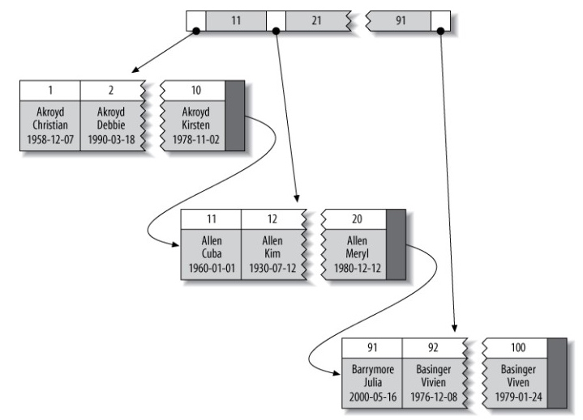

# Mysql
## 一. 存储引擎的区别
#### 1. InnoDB
InnoDB支持事务，是面向在线事务处理(OLTP)的应用,特点是**行锁设计**，支持外键，并支持一致性非锁定读，即默认情况下读取操作不会产生锁．是默认的**存储引擎**:．还提供了插入缓冲，二次写，自适应哈希索引，预读等高性能和高可用的功能．并支持全文索引。

- 采用 MVCC 来支持高并发，并且实现了四个标准的隔离级别，**默认级别是可重复读（REPEATABLE READ）**，并且通过间隙锁（next-key locking）策略防止幻读的出现。间隙锁使得 InnoDB 不仅仅锁定查询涉及的行，还会对索引中的间隙进行锁定，以防止幻影行的插入。

- 表是基于**聚簇索引**建立的，它对主键的查询性能有很高的提升。

- 内部做了很多**优化**，包括从磁盘读取数据时采用的可预测性读、能够自动在内存中创建哈希索引以加速读操作的自适应哈希索引、能够加速插入操作的插入缓冲区等。

- 通过一些机制和工具支持真正的热备份。其它存储引擎不支持热备份，要获取一致性视图需要停止对所有表的写入，而在读写混合场景中，停止写入可能也意味着停止读取。 

#### 2. MyISAM
**不支持事务，是表锁设计和支持全文索引**，主要面向一些OLAP的数据库应用. 它的缓冲池只缓冲索引文件，而不缓冲数据文件。该存储引擎表由MYD和MYI组成，MYD用来存放数据文件，MYI用来存放索引文件. MyISAM 提供了大量的特性，包括**全文索引、压缩表、空间数据索引**等

#### 3. NDB
NDB是一个**集群存储引擎**，其特点是**数据全部放在内存中**，因此主键查找速度极快，并通过添加NDB数据库存储节点可以线性提高数据库性能，是高可用，高性能的集群系统．

#### 4. Memory
**Memory**: 将表中的数据存放在内存中，如果数据库重启或发生崩溃，表中的数据库都将消失，它非常适合存储临时数据的临时表．默认采用哈希索引．

#### 5. Archive
**Archive**只支持**INSERT和SELECT**操作，使用**zlib算法将数据行进行压缩**，压缩比可以达到1:10，非常适合存储归档数据.但其本身不是事务安全的存储引擎，其设计目标是提供高速的插入和压缩功能．

#### 6. Federated
**Federated**并不存放数据，它只是指向一台远程MySQL数据库服务器上的表.

#### 7. Maria存储引擎
**Maria存储引擎** 设计目标主要是用来取代原有的MyISAM存储引擎．

### InnoDB和MyISAM比较
1. 事务：InnoDB 是事务型的。MyISAM不支持事务。
2. 备份：InnoDB 支持在线热备份。
3. 崩溃恢复：MyISAM 崩溃后发生损坏的概率比 InnoDB 高很多，而且恢复的速度也更慢。
4. 并发：MyISAM 只支持表级锁，而 InnoDB 还支持行级锁。
5. 其它特性：MyISAM 支持压缩表和空间数据索引。


# 二、数据类型
### 1) 整数类型

| 类型 | 大小 | 用途 |
| --- | --- | --- |
| TINYINT | 1 字节 | 小整数值 |
| SMALLINT | 2 字节 | 大整数值 |
| MEDIUMINT | 3 字节 | 大整数值 |
| INT | 4 字节 | 大整数值 |
| BIGINT | 8 字节 | 极大整数值 |


一般情况下越小的列越好。在使用这些类型时，我们一般会在类型后面添加括号指定显示字符格式，如INT(11) 中的数字只是**规定了交互工具显示字符的个数**，对于存储和计算来说是没有意义的。

### 2) 浮点数

| 类型 | 大小 | 用途 |
| --- | --- | --- |
| FLOAT | 4 字节 | 单精度 浮点数值 |
| DOUBLE | 8 字节	 | 双精度 浮点数值 |
| DECIMAL | DECIMAL(M,D) ，如果M>D，为M+2否则为D+2 | 小数值 |


**FLOAT** 和 **DOUBLE** 为浮点类型，**DECIMAL** 为高精度小数类型。CPU 原生支持浮点运算，但是不支持 DECIMAl 类型的计算，因此 DECIMAL 的计算比浮点类型需要更高的代价。

FLOAT、DOUBLE 和 DECIMAL 都可以指定列宽，例如 DECIMAL(18, 9) 表示总共 18 位，取 9 位存储小数部分，剩下 9 位存储整数部分。

### 3) 字符串

| 类型 | 大小 | 用途 |
| --- | --- | --- |
| CHAR | 0-255字节 | 定长字符串 |
| VARCHAR | 0-65535 字节	 | 变长字符串 |
| TINYBLOB | 0-255字节 | 不超过 255 个字符的二进制字符串 |
| TINYTEXT | 0-255字节 | 短文本字符串 |
| BLOB | 0-65 535字节	 | 二进制形式的长文本数据 |
| TEXT | 0-65 535字节 | 长文本数据 |
| MEDIUMBLOB | 0-16 777 215字节 | 二进制形式的中等长度文本数据 |
| MEDIUMTEXT | 0-16 777 215字节 | 中等长度文本数据 |
| LONGBLOB | 0-4 294 967 295字节 | 二进制形式的极大文本数据 |
| LONGTEXT | 0-4 294 967 295字节 | 极大文本数据 |


VARCHAR 这种变长类型能够节省空间，因为只需要存储必要的内容。但是在执行 UPDATE 时可能会使行变得比原来长，当超出一个页所能容纳的大小时，就要执行额外的操作。MyISAM 会将行拆成不同的片段存储，而 InnoDB 则需要分裂页来使行放进页内。

VARCHAR 会保留字符串末尾的空格，而 CHAR 会删除。

### 4) 时间和日期

| 类型 | 大小| 格式 | 用途 | 
| --- | --- | --- | --- | 
| DATE | 3字节 | YYYY-MM-DD | 日期值 | 
| TIME | 3字节	 | HH:MM:SS | 时间值或持续时间 |
| YEAR | 1字节 | YYYY | 年份值 | 
| DATETIME | 8字节 | YYYY-MM-DD HH:MM:SS | 混合日期和时间值 |
| TIMESTAMP | 4字节	 | YYYYMMDD HHMMSS | 混合日期和时间值，时间戳 |

**DATATIME**: 

 - 能够保存从 1001 年到 9999 年的日期和时间，**精度为秒**，使用 8 字节的存储空间。
 - **它与时区无关**.
 - 默认情况下，MySQL 以一种可排序的、无歧义的格式显示 DATATIME 值，例如“2008-01-16 22:37:08”，这是 ANSI 标准定义的日期和时间表示方法。

**TIMESTAMP**: 

 - 和 UNIX 时间戳相同，保存从 1970 年 1 月 1 日午夜（格林威治时间）以来的秒数，使用4个字节，只能表示从1970年到2038年。
 - **它和时区有关**。
 - 默认情况下，如果插入时没有指定 TIMESTAMP 列的值，会将这个值设置为当前时间。
 - 应该尽量使用 TIMESTAMP，因为它比 DATETIME 空间效率更高。
 - MySQL 提供了 FROM_UNIXTIME() 函数把 UNIX 时间戳转换为日期，并提供了 UNIX_TIMESTAMP() 函数把日期转换为 UNIX 时间戳。

# 索引
## 索引分类
### 1. B+Tree 索引
### 2. 哈希索引
### 3. 空间数据索引（R-Tree）
### 4. 全文索引
## 索引的优点

- 大大减少了服务器需要扫描的数据量；
- 帮助服务器避免进行排序和创建临时表（B+Tree 索引是有序的，可以用来做 ORDER BY 和 GROUP BY 操作）；
- 将随机 I/O 变为顺序 I/O（B+Tree 索引是有序的，也就将相邻的列值都存储在一起）。

## 索引优化
### 1. 独立的列

在进行查询时，索引列不能是表达式的一部分，也不能是函数的参数，否则无法使用索引。

例如下面的查询不能使用 actor_id 列的索引：

```sql
SELECT actor_id FROM sakila.actor WHERE actor_id + 1 = 5;
```

### 2. 前缀索引

对于 BLOB、TEXT 和 VARCHAR 类型的列，必须使用前缀索引，只索引开始的部分字符。

对于前缀长度的选取需要根据**索引选择性**  来确定：不重复的索引值和记录总数的比值。选择性越高，查询效率也越高。最大值为 1，此时每个记录都有唯一的索引与其对应。

### 3. 多列索引

在需要使用多个列作为条件进行查询时，使用多列索引比使用多个单列索引性能更好。例如下面的语句中，最好把 actor_id 和 film_id 设置为多列索引。

```sql
SELECT film_id, actor_ id FROM sakila.film_actor
WhERE actor_id = 1 AND film_id = 1;
```

### 4. 索引列的顺序

让选择性最强的索引列放在前面，例如下面显示的结果中 customer_id 的选择性比 staff_id 更高，因此最好把 customer_id 列放在多列索引的前面。

```sql
SELECT COUNT(DISTINCT staff_id)/COUNT(*) AS staff_id_selectivity,
COUNT(DISTINCT customer_id)/COUNT(*) AS customer_id_selectivity,
COUNT(*)
FROM payment;
```

```html
   staff_id_selectivity: 0.0001
customer_id_selectivity: 0.0373
               COUNT(*): 16049
```


### 5. 聚簇索引

<div align="center">  </div>

聚簇索引并不是一种索引类型，而是一种数据存储方式。

术语“聚簇”表示数据行和相邻的键值紧密地存储在一起，InnoDB 的聚簇索引在同一个结构中保存了 B+Tree 索引和数据行。

因为无法把数据行存放在两个不同的地方，所以一个表只能有一个聚簇索引。

**优点** 

1. 可以把相关数据保存在一起，减少 I/O 操作。例如电子邮件表可以根据用户 ID 来聚集数据，这样只需要从磁盘读取少数的数据也就能获取某个用户的全部邮件，如果没有使用聚聚簇索引，则每封邮件都可能导致一次磁盘 I/O。
2. 数据访问更快。

**缺点** 

1. 聚簇索引最大限度提高了 I/O 密集型应用的性能，但是如果数据全部放在内存，就没必要用聚簇索引。
2. 插入速度严重依赖于插入顺序，按主键的顺序插入是最快的。
3. 更新操作代价很高，因为每个被更新的行都会移动到新的位置。
4. 当插入到某个已满的页中，存储引擎会将该页分裂成两个页面来容纳该行，页分裂会导致表占用更多的磁盘空间。
5. 如果行比较稀疏，或者由于页分裂导致数据存储不连续时，聚簇索引可能导致全表扫描速度变慢。

### 6. 覆盖索引

索引包含所有需要查询的字段的值。

**优点** 

1. 因为索引条目通常远小于数据行的大小，所以若只读取索引，能大大减少数据访问量。
2. 一些存储引擎（例如 MyISAM）在内存中只缓存索引，而数据依赖于操作系统来缓存。因此，只访问索引可以不使用系统调用（通常比较费时）。
3. 对于 InnoDB 引擎，若二级索引能够覆盖查询，则无需访问聚簇索引。


