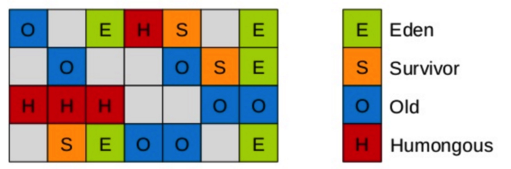
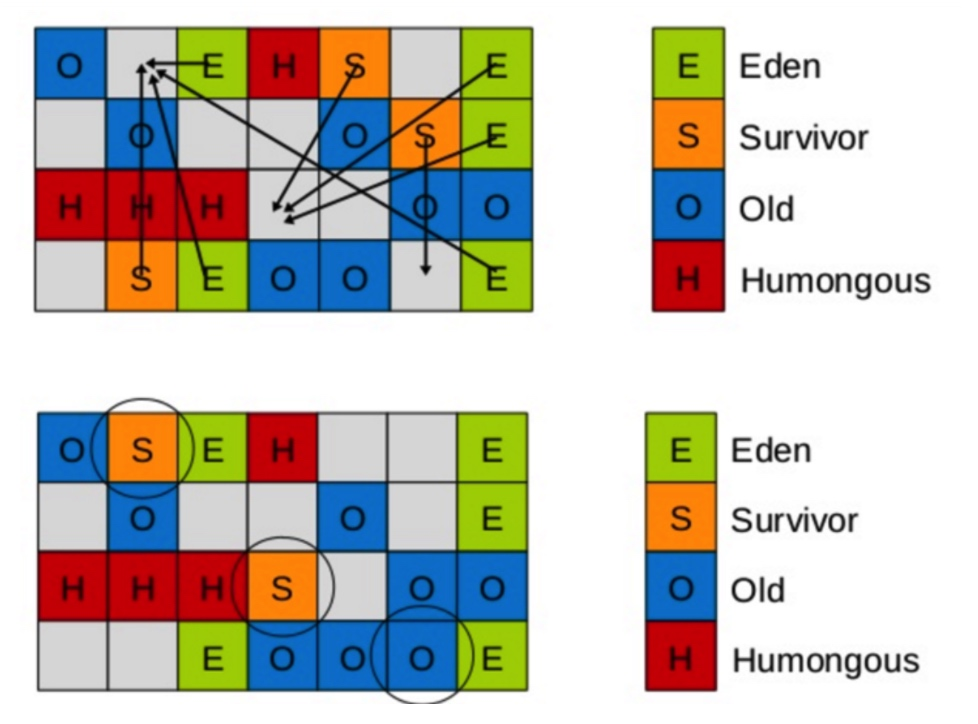
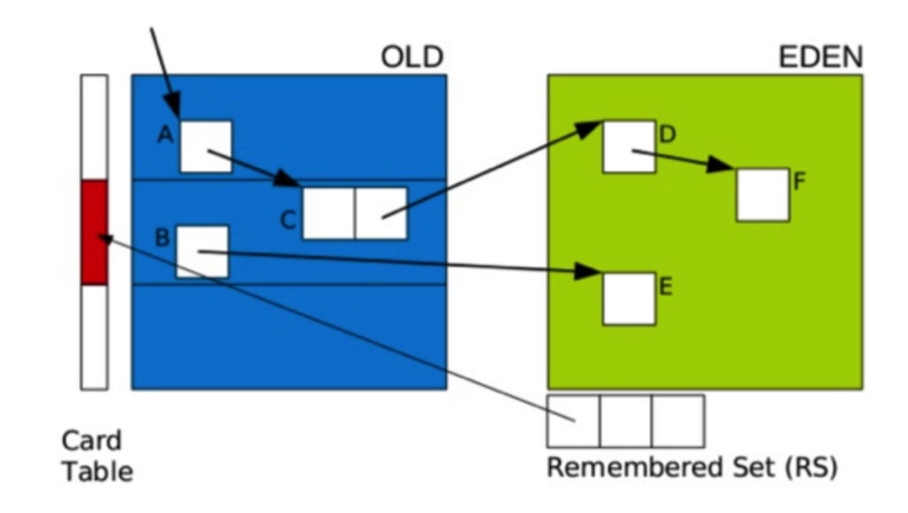
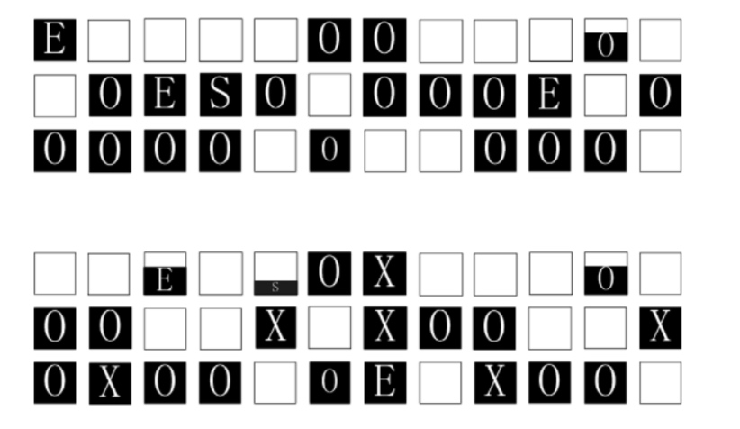
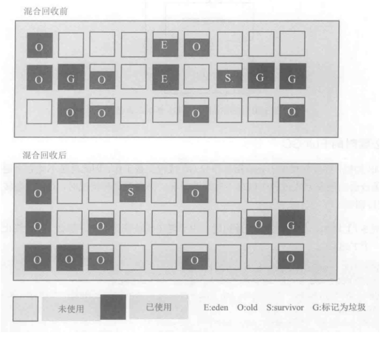
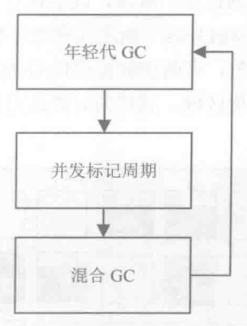

# G1垃圾回收期

# 一. 介绍

G1将新生代/老年代的物理空间划分取消了，不再为新生代和老年代分配连续的大空间. 取而代之的是，G1算法将堆划分为若干个区域（Region），每个区域可以是年轻代也可以是老年代，它仍然属于分代收集器。新生代和老年代不再分配连续的物理空间，而是分配块区域。跟踪这些区域的垃圾堆积程度， 在后台维护一个优先列表，每次运行的收集时间，优先回收垃圾最多的区域，这种方式可以减少一些内存碎片，也提高内存回收效率。这也是为什么G1命名为**Garbage First的原因：第一时间处理垃圾最多的区块**。

<div align="center"> </div>

这些区域的一部分包含新生代，一部分包含老年代。新生代的垃圾收集依然采用暂停所有应用线程的方式，将存活对象拷贝到老年代或者Survivor空间。老年代也分成很多区域，G1收集器通过将对象从一个区域复制到另外一个区域，完成了清理工作。这就意味着，在正常的处理过程中，G1完成了堆的压缩（至少是部分堆的压缩），这样也就不会有cms内存碎片问题的存在了。

在G1中，还有一种特殊的区域，叫Humongous区域。 如果一个对象占用的空间超过了分区容量50%以上，G1收集器就认为这是一个巨型对象。这些巨型对象，默认直接会被分配在年老代，但是如果它是一个短期存在的巨型对象，就会对垃圾收集器造成负面影响。为了解决这个问题，G1划分了一个Humongous区，它用来专门存放巨型对象。如果一个H区装不下一个巨型对象，那么G1会寻找连续的H分区来存储。为了能找到连续的H区，有时候不得不启动Full GC。


那么G1相对于CMS的区别在：

 - G1在压缩空间方面有优势
 - G1通过将内存空间分成区域（Region）的方式避免内存碎片问题 
 - Eden, Survivor, Old区不再固定、在内存使用效率上来说更灵活
 - G1可以通过设置**预期停顿时间**（Pause Time）来控制垃圾收集时间避免应用雪崩现象
 - G1在回收内存后会马上同时做合并空闲内存的工作、而CMS默认是在STW（stop the world）的时候做
 - G1会在Young GC中使用、而CMS只能在O区使用

# 二. GC 垃圾收集过程

G1 垃圾收集过程主要分为4个阶段：

 - YGC（不同于CMS）
 - 并发标记周期
 - 混合模式
 - full GC （一般是G1出现问题时发生）

## 2.1 YGC 

<div align="center">  </div>


Young GC主要是对Eden区进行GC，`它在Eden空间耗尽时会被触发`。在这种情况下，Eden空间的数据移动到Survivor空间中，如果Survivor空间不够，Eden空间的部分数据会直接晋升到年老代空间。Survivor区的数据移动到新的Survivor区中，也有部分数据晋升到老年代空间中。最终Eden空间的数据为空，GC停止工作，应用线程继续执行。

下面是一个Young GC的例子：

```
23.430: [GC pause (young), 0.23094400 secs]
...
[Eden: 1286M(1286M)->0B(1212M)
Survivors: 78M->152M Heap: 1454M(4096M)->242M(4096M)]
[Times: user=0.85 sys=0.05, real=0.23 secs]
```

上面日志的内容解析：

- Young GC实际占用230毫秒、其中GC线程占用850毫秒的CPU时间
- E：内存占用从1286MB变成0、都被移出
- S：从78M增长到了152M、说明从Eden移过来74M
- Heap:占用从1454变成242M、说明这次Young GC一共释放了1212M内存空间

很多情况下，S区的对象会有部分晋升到Old区，另外如果S区已满、Eden存活的对象会直接晋升到Old区，这种情况下Old的空间就会涨

这时，我们需要考虑一个问题，如果仅仅GC 新生代对象，我们如何找到所有的根对象呢？ 老年代的所有对象都是根么？那这样扫描下来会耗费大量的时间。于是，G1引进了RSet的概念。它的全称是Remembered Set，作用是跟踪指向某个heap区内的对象引用。

<div align="center">  </div>


如果引用的对象很多，赋值器需要对每个引用做处理，赋值器开销会很大，为了解决赋值器开销这个问题，在G1 中又引入了另外一个概念，卡表（Card Table）。一个Card Table将一个分区在逻辑上划分为固定大小的连续区域，每个区域称之为卡。卡通常较小，介于128到512字节之间。Card Table通常为字节数组，由Card的索引（即数组下标）来标识每个分区的空间地址。默认情况下，每个卡都未被引用。当一个地址空间被引用时，这个地址空间对应的数组索引的值被标记为”0″，即标记为脏被引用，此外RSet也将这个数组下标记录下来。一般情况下，这个RSet其实是一个Hash Table，Key是别的Region的起始地址，Value是一个集合，里面的元素是Card Table的Index。

## 2.2 并发标记阶段

<div align="center">  </div>

G1并发标记周期可以分成几个阶段：

 - **初始标记阶段(Initial Marking)**： 标记从根节点直接可达的对象，`这个阶段会伴随一次新生代GC`，eden被清空，并且将存活对象移动到survivor中。 它会产生全局停顿，`应用程序必须在这个阶段停止运行`。
 - **根区域扫描**:  扫描survivor区，标记直接可达对象。 这个过程和应用程序可以并行执行，但根区域扫描不能和新生代GC同时进行。`如果恰好此刻新生代也在执行，那么需要等待根区域扫描结束以后才能进行，这样YGC的时间就会延长。`
 - **并发标记 （Concurrent Marking）**：和CMS一样，是从GC Roots开始对堆中的对象进行可达性分析，找出存活对象。耗时比较长，是一个并发过程，可以和用户程序并发。同时运行被新生代GC打断。
 - **重新标记/最终标记(Final Marking)**： 和CMS一样，重新标记会产生应用程序停顿，对并发过程中标记结果进行纠正。这个过程使用的是SATB（Snapshot-At-The-Begining）算法完成， 即G1在标记之初会为存活对象创建一个快照，这个快照有助于加速重新标记速度。
 - **筛选回收(Live Data Counting and Evacuation)**： 这个阶段会引起停顿，首先对各个Region的回收价值和成本进行排序，根据用户所期望的GC回收时间指定回收计划。这个阶段还会更新记忆集(Remembered Set) 。 该阶段给出了需要被混合回收的区域并进行标记，在混合回收阶段需要这些信息。
 - **并发清理阶段**： 这里是识别并清理完全空闲的区域，它是并发清理，不会引起停顿。

 
### 1. 初始标记阶段
第一个阶段是初始标记阶段。这个阶段会暂停所有应用线程-部分原因是这个过程会执行一次YGC、下面是一个日志示例：

```
50.541: [GC pause (young) (initial-mark), 0.27767100 secs]
[Eden: 1220M(1220M)->0B(1220M)
Survivors: 144M->144M Heap: 3242M(4096M)->2093M(4096M)]
[Times: user=1.02 sys=0.04, real=0.28 secs]
```

上面的日志表明发生了YGC、应用线程为此暂停了280毫秒，Eden区被清空（71MB从Young区移到了O区）。

日志里面initial-mark的字样表明后台的并发GC阶段开始了。因为初始标记阶段本身也是要暂停应用线程的，G1正好在YGC的过程中把这个事情也一起干了。为此带来的额外开销不是很大、增加了20%的CPU，暂停时间相应的略微变长了些。

### 2. 根区域扫描
接下来，G1开始扫描根区域、日志示例：

```
50.819: [GC concurrent-root-region-scan-start]
51.408: [GC concurrent-root-region-scan-end, 0.5890230]
```

一共花了580毫秒，这个过程没有暂停应用线程；是后台线程并行处理的。这个阶段不能被YGC所打断、因此后台线程有足够的CPU时间很关键。如果Young区空间恰好在Root扫描的时候满了、YGC必须等待root扫描之后才能进行。带来的影响是YGC暂停时间会相应的增加。这时的GC日志是这样的：

```
350.994: [GC pause (young)
351.093: [GC concurrent-root-region-scan-end, 0.6100090]
351.093: [GC concurrent-mark-start],0.37559600 secs]
```

### 3. 并发标记
在root扫描完成后，G1进入了一个并发标记阶段。这个阶段也是完全后台进行的；GC日志里面下面的信息代表这个阶段的开始和结束：

```
2018-02-02T17:31:32.077+0800: 48.625: [GC concurrent-mark-start]
2018-02-02T17:31:32.180+0800: 48.728: [GC concurrent-mark-end, 0.1030567 secs]
```

并发标记阶段是可以被打断的，比如这个过程中发生了YGC。

### 4. 重新标记
这两个阶段同样会暂停应用线程，引起全局停顿(Stop of the world)，但时间很短。

```
[GC remark 2018-02-02T17:31:32.181+0800: 48.728: [Finalize Marking, 0.0064290 secs] 2018-02-02T17:31:32.187+0800: 48.735: [GC ref-proc, 0.0009395 secs] 2018-02-02T17:31:32.188+0800: 48.736: [Unloading, 0.1899474 secs], 0.1986697 secs]
[Times: user=0.19 sys=0.20, real=0.20 secs] 
```

### 5. 筛选回收
重新标记后会进行独占清理，独占清理会重新计算各个区域的存活对象，以此得到各个区域的回收价值和成本，并更新优先列表。

```
2018-02-02T17:31:32.381+0800: 48.928: [GC cleanup 139M->132M(1792M), 0.0035090 secs]
[Times: user=0.02 sys=0.01, real=0.00 secs] 
```
### 6. 并发清理
并发执行，根据筛选回收阶段的得到的各个区域存活对象的数量，直接回收已经不包含存活对象的区域。 日志如下：

```
2018-02-02T17:31:32.384+0800: 48.932: [GC concurrent-cleanup-start]
2018-02-02T17:31:32.384+0800: 48.932: [GC concurrent-cleanup-end, 0.0000717 secs]
```

### 完整日志

```
[Eden: 859.0M(859.0M)->0.0B(828.0M) Survivors: 41.0M->72.0M Heap: 945.5M(1792.0M)->117.0M(1792.0M)]
[Times: user=0.50 sys=0.11, real=0.32 secs]     // YGC 
2018-02-02T17:31:31.602+0800: 48.149: [GC pause (Metadata GC Threshold) (young) (initial-mark)   //  初始标记
Desired survivor size 59244544 bytes, new threshold 15 (max 15)
- age 1: 32290680 bytes, 32290680 total
- age 2: 7557464 bytes, 39848144 total
- age 3: 54816 bytes, 39902960 total
, 0.3284738 secs]
2018-02-02T17:31:31.931+0800: 48.478: [GC concurrent-root-region-scan-start]  //  根区域扫描
2018-02-02T17:31:32.077+0800: 48.625: [GC concurrent-root-region-scan-end, 0.1465085 secs]
2018-02-02T17:31:32.077+0800: 48.625: [GC concurrent-mark-start]   // 并发标记
2018-02-02T17:31:32.180+0800: 48.728: [GC concurrent-mark-end, 0.1030567 secs]    
2018-02-02T17:31:32.181+0800: 48.728: [GC remark 2018-02-02T17:31:32.181+0800: 48.728: [Finalize Marking, 0.0064290 secs] 2018-02-02T17:31:32.187+0800: 48.735: [GC ref-proc, 0.0009395 secs] 2018-02-02T17:31:32.188+0800: 48.736: [Unloading, 0.1899474 secs], 0.1986697 secs]  // 重新标记
 [Times: user=0.19 sys=0.20, real=0.20 secs] 
2018-02-02T17:31:32.381+0800: 48.928: [GC cleanup 139M->132M(1792M), 0.0035090 secs]   // 筛选回收
 [Times: user=0.02 sys=0.01, real=0.00 secs] 
2018-02-02T17:31:32.384+0800: 48.932: [GC concurrent-cleanup-start]  // 并发清理
2018-02-02T17:31:32.384+0800: 48.932: [GC concurrent-cleanup-end, 0.0000717 secs]

```

## 2.3 混合回收
并发周期虽然有回收部分对象被回收，但是总体上回收比例相对很低。在并发标记周期以后已经知道哪些区域的垃圾比较多，因此在混合回收阶段主要是针对这些区域进行回收，优先回收垃圾比较高的区域。 这也是G1 垃圾回收器(Garbage First Garbage Collector)名字的由来。

这这个阶段会即会执行正常的年轻代GC, 也会选取一些被标记的老年代区域进行回收：

<div align="center">  </div>

```
2018-02-03T03:27:17.380+0800: 35793.927: [GC pause (G1 Evacuation Pause) (mixed)
Desired survivor size 59244544 bytes, new threshold 15 (max 15)
- age 1: 1996696 bytes, 1996696 total
- age 2: 459960 bytes, 2456656 total
- age 3: 400072 bytes, 2856728 total
- age 4: 701968 bytes, 3558696 total
- age 5: 24731128 bytes, 28289824 total
, 0.4065425 secs]
   [Parallel Time: 391.1 ms, GC Workers: 10]
   [Eden: 869.0M(869.0M)->0.0B(869.0M) Survivors: 31.0M->31.0M Heap: 1369.4M(1792.0M)->447.2M(1792.0M)]
 [Times: user=0.66 sys=0.14, real=0.40 secs] 
```

`混合GC会执行多次`，直到回收了足够多的内存空间，然后会触发一次新生代的 YGC。 可能会进入新一轮的处理过程：

<div align="center">  </div>

## 2.4 FULL GC
在必要的时候需要执行一次Full GC, 因为垃圾回收线程和应用线程并发执行，难免会遇到内存清理过程出现内存不足的时候。如果出现这种情况，G1也会转入一个Full GC 进行回收。

```
[Times: user=2.58 sys=0.13, real=1.40 secs] 
2018-02-03T16:22:12.694+0800: 82289.242: [Full GC (Allocation Failure) 1383M->636M(1792M), 3.9350032 secs]
```


# 参考

 - 《深入理解java虚拟机》
 -  《实战java虚拟机》
 - http://blog.jobbole.com/109170/
 - http://ifeve.com/%E6%B7%B1%E5%85%A5%E7%90%86%E8%A7%A3g1%E5%9E%83%E5%9C%BE%E6%94%B6%E9%9B%86%E5%99%A8/

