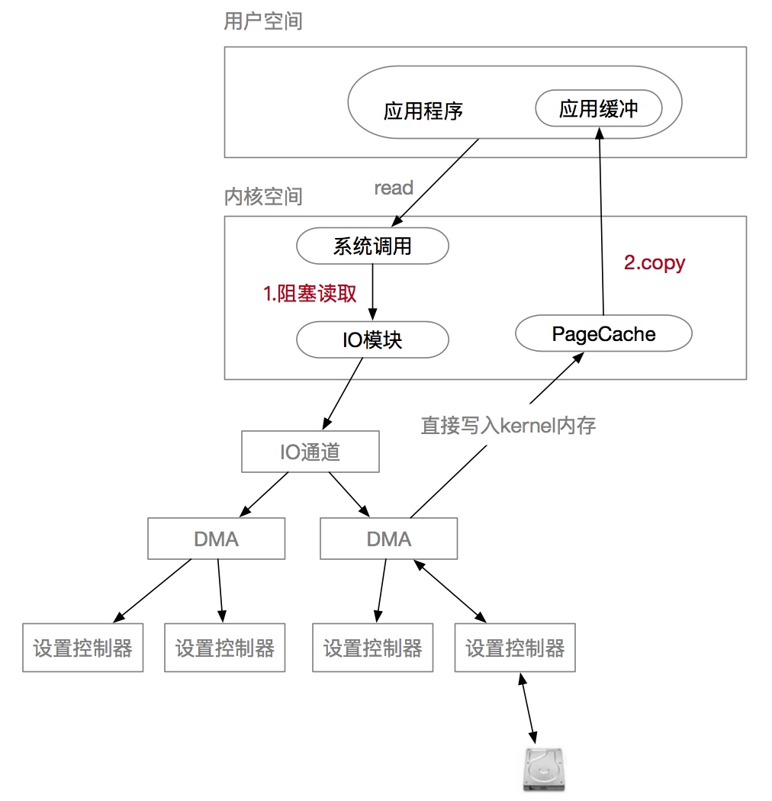
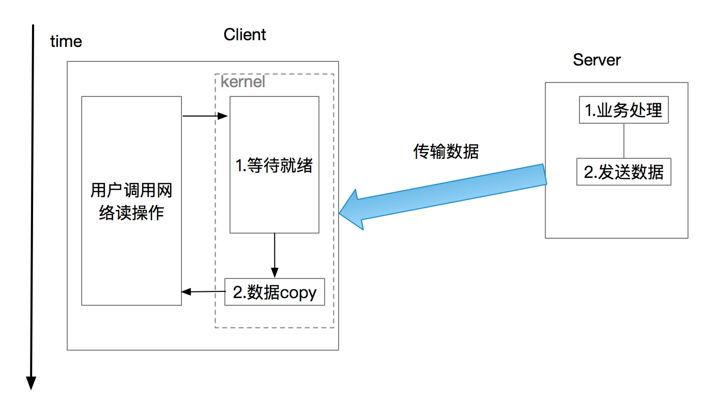
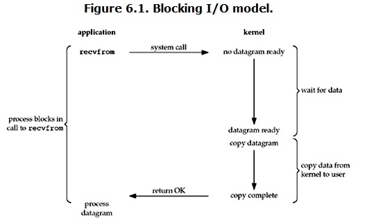
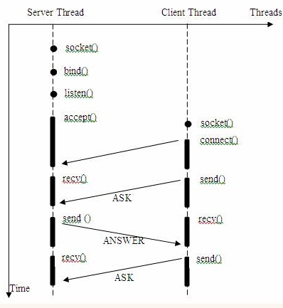
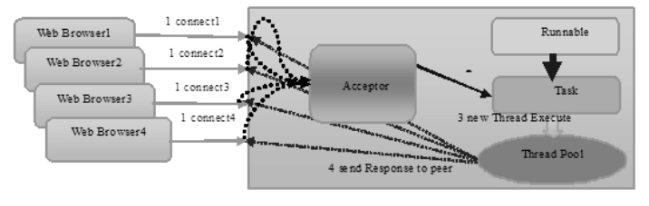
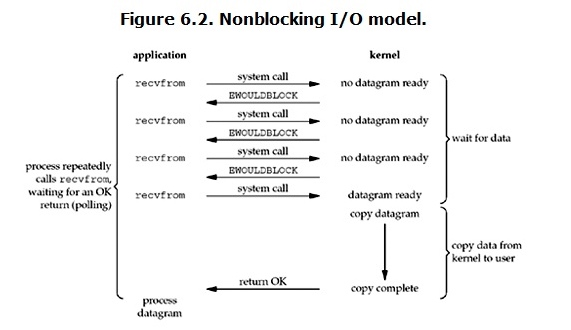
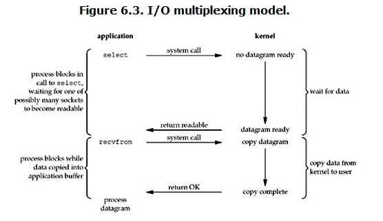
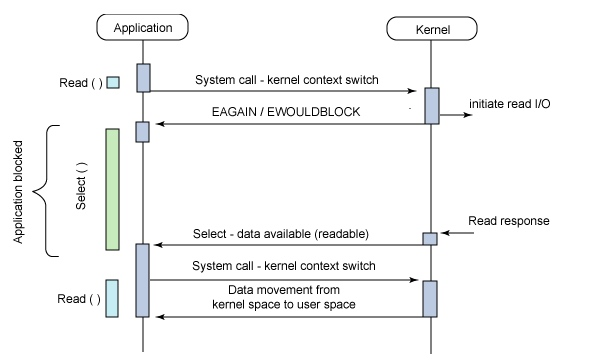
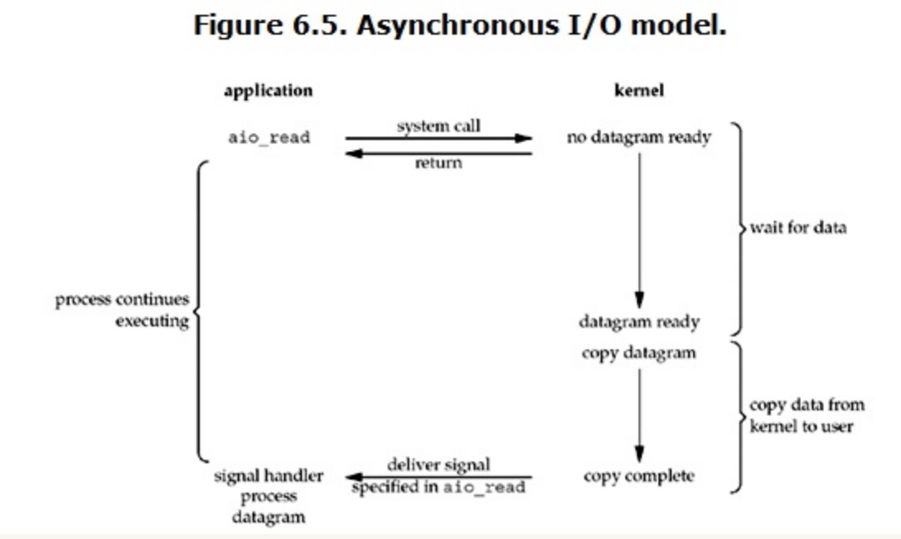
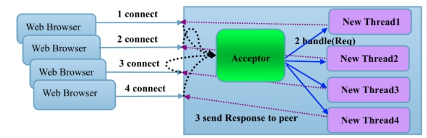

# Java IO/NIO
 
# 一. linux 底层实现
## 1.1 kernel IO
用户进程进行I/O操作的时候实际上交给了kernel进行执行，kernel执行的I/O操作可以分为两个阶段：

  

- **准备阶段**：在执行I/O操作的时候需要等待I/O是否就绪，因为此刻IO设备在忙状态。以网络IO为例，在读取远程数据时，需要阻塞等待远程将数据发送过来，很多时候数据在一开始还没有到达（比如，还没有收到一个完整的UDP包），这个时候kernel就要等待足够的数据到来。 

  

 
- **用户进程空间和内核空间的数据拷贝** : 当等到数据准备好了，kernel就会将数据从从kernel中拷贝到用户内存，然后kernel返回结果，用户进程才解除block的状态，重新运行起来。

准备阶段时，CPU内容发送指令给IO通道，让IO通道负责执行IO的读写操作。CPU不用一直阻塞可以继续执行别的逻辑，但此刻IO线程会挂起，等待IO通道读写操作完成通知。 IO通道将操作交给DMA，DMA直接连接设备控制器负责将设备控制器中的数据直接读入到内核内存中。读完成后通知通道告知IO处理完成，IO通道发送中断给CPU，原内核IO线程醒来继续执行后续工作

## 1.1 I/O 模型
根据IO对kernel IO操作两个阶段的感知能力可以分为一下四种IO模型：

- **阻塞（Blocking）**：阻塞等待IO就绪，这期间用户线程不可以做其他事情。
- **非阻塞（Non-blocking）**：轮询感知IO就绪，用户线程可以做其他事情。
- **同步（Synchronous）**：同步等待读IO读写结果。
- **异步（Asynchronous）**：异步等待kernel通知IO读写结果。

**IO阻塞和非阻塞主要关注IO的就绪状态的感知方式，同步和异步关注IO读写操作的结果获取方式**。同步是指函数完成之前会一直等待；阻塞 是指系统调用的时候进程会被设置为Sleep状态直到等待的事件发生（比如有新的数据）。

### 阻塞和非阻塞

阻塞和非阻塞是一种**调用机制**，用来描述进程处理调用的方式。在IO中两者的**区别主要体现在I/O未准备好时，用户线程是否可以做其他事情**。比如网络读操作，根据是否需要等待kernel数据准备好。

阻塞是等待某个事件的就绪/发生，当前线程会被**挂起**，一直处于等待消息通知，不能执行其他业务。**阻塞通信意味着通信方法在尝试访问套接字或者读写数据时阻塞了对套接字的访问**。以网络读操作为例，用户线程在socket中调用recv函数时，如果缓冲区中没有数据，则需要一直阻塞等待服务端发来的数据，这时候线程会挂起等待。 

非阻塞和阻塞的概念相对应，指在不能立刻得到结果之前，该函数不会阻塞当前线程，而会立刻返回。非阻塞IO是用户线程不会一直阻塞待待IO就绪，通过不断轮询的方式来查看就绪状态。。

### 同步和异步
同步和异步是一种**通信机制**，涉及到调用方和被调用方，**关注的是IO操作结果的获知方式，主要区别在于IO结果未返回时用户线程是否可以做其他事情**：

 -  **同步**是调用方需要保持等待直到IO操作完成，进而通过返回获得结果；
 -  **异步**则调用方在IO操作的执行过程中不需要保持等待，而是在操作完成后被动的接受（通过消息或回调）被调用方推送的结果。

以下是同步和异步定义：

>**A synchronous I/O** operation causes the requesting process to be blocked until that I/O operation completes;
>**An asynchronous I/O** operation does not cause the requesting process to be blocked;

同步和异步的区别也在于在进行整个IO操作的时候会用户进程**是否会阻塞等待结果**，linux中IO模型中blocking IO，non-blocking IO，IO multiplexing都属于synchronous IO。

## 1.2 linux I/O 模型

linux根据用户进程对这个两个阶段的感知方式分为5中I/O模型：

 - 阻塞I/O（bloking IO）
 - 非阻塞I/O（non-blocking IO）
 - 多路复用IO（multiplexing IO）
 - 信号驱动式IO（signal-driven IO）
 - 异步IO（asynchronous IO）

### 1） 阻塞IO（blocking IO）
默认情况下所有的socket都是blocking

  

 当用户进程调用了recvfrom这个系统调用，就**阻塞等待结果**。kernel负责完成IO操作，完成后返回给用户。用户进程需要阻塞等待kernel完成两个阶段操作：**准备数据(wait for data)**、 **数据拷贝到用户进程空间(copy data from kenel to user)**。 阻塞IO是同步阻塞IO, 准备数据阶段会阻塞并同步等待I/O结果。在准备阶段和数据拷贝阶段中，用户线程都会被阻塞。
 
使用linux中进行网络编程时，一般都从listen()、send()、recv() 等接口开始，这些接口都是阻塞型。使用这些接口可以方便构建服务器/客户机模型。下面是一个简单地“一问一答”服务器。 整体流程如下:

  

**服务器实现模式为一个连接一个线程，即客户端有连接请求时服务器端就需要启动一个线程进行处理**，如果这个连接不做任何事情会造成不必要的线程开销。通常会对它的线程模型进行优化，后端通过一个线程池来处理多个客户端的请求接入。通过“线程池”减少创建和销毁线程的频率，其维持一定合理数量的线程，并让空闲的线程重新承担新的执行任务，提高系统性能。

  

java 的BIO就是采用这种模式实现的。

### 2）非阻塞IO（non-blocking IO）

  

当用户进程发出read操作时，如果kernel中的数据还没有准备好，那么它**并不会block用户进程，而是立刻返回一个error**。整体流程是：

1. 用户线程轮询查看kernel是否准备好数据（datagram ready）。这个过程kernel主要处于wait for data阶段。
2. 当用户调用read, kernel已准备好数据，则执行数据拷贝操作，**用户线程阻塞直到数据读取完成**。kernel读取数据完成后，返回给用户数据。 

从用户进程角度讲 ，它发起一个read操作后，并不需要等待，而是马上就得到了一个结果。用户进程判断结果是一个error时，它就知道数据还没有准备好，于是它可以再次发送read操作。一旦kernel中的数据准备好了，并且又再次收到了用户进程的system call，那么它马上就将数据拷贝到了用户内存，然后返回。

**在非阻塞式IO中，用户进程其实是需要不断的主动询问kernel数据准备好了没有，非阻塞的接口相比于阻塞型接口的显著差异在于，在被调用之后立即返回。**

**non-blocking IO在执行recvfrom这个系统调用的时候，如果kernel的数据没有准备好，这时候不会block进程。但是当kernel中数据准备好的时候，recvfrom会将数据从kernel拷贝到用户内存中，这个时候进程是被block了，在这段时间内进程是被block的**，因此属于同步IO。

优点：

1. 用户进程不会被阻塞，可以在期间做一些别的事情。

缺点：

1. 用户线程不知道什么时候完成，需要不断的轮询查看I/O操作结果。看是否已经读取完成，增加了用户使用的复杂度。
2. 在数据copy部分用户进程还是需要阻塞。

### 3）多路复用IO（IO multiplexing）
IO multiplexing，也称这种IO方式为**事件驱动IO(event driven IO)**。非阻塞IO（non-blocking IO）模式需要用户自己去轮询查看是否数据准备好，如果准备好则阻塞调用kernel进行copy。多路复用IO就是解决这种轮询问题，linux内部提供了select/poll/epoll来完成IO复用。

select/poll/epoll的好处就在于单个process就可以同时处理多个网络连接的IO。它的基本原理就是select/poll/epoll这个function会不断的轮询所负责的所有socket，当某个socket有数据到达了，就通知用户进程。它的流程如图：

  

#### select 

select的调用过程如下所示：

  

select负责管理多个FD文件描述符，kernel就会**轮询**检查所有select负责的fd，看是否有一个FD的数据已准备好。select会返回kernel数据准备就绪的FD， FD调用read操作让kernel完成数据的拷贝。 select解决了非阻塞状态下用户进程需要自己轮询的问题，同时可以用一个线程管理多个用户进程的读写操作。

select的缺点：

 - 单个进程能够监视的文件描述符的**数量存在最大限制**，**通常是1024**，当然可以更改数量。
 - 对socket进行扫描时是线性扫描，即采用轮询的方法，效率较低。
 - 内核/用户空间内存拷贝问题。每次调用select，**都需要把fd集合从用户态拷贝到内核态**，这个开销在fd(客户端套接字)很多时会很大。
 
#### poll
**poll本质上和select没有区别，它将用户传入的数组拷贝到内核空间**。然后查询每个fd对应的设备状态，如果设备就绪则在设备等待队列中加入一项并继续遍历，如果遍历完所有fd后没有发现就绪设备，则挂起当前进程，直到设备就绪或者主动超时，被唤醒后它又要再次遍历fd。这个过程经历了多次无谓的遍历。

**它没有最大连接数的限制，原因是它是基于链表来存储的**，但是同样有一个缺点：

- 1）大量的fd的数组被整体复制于用户态和内核地址空间之间，而不管这样的复制是不是有意义。
- 2）poll还有一个特点是“水平触发”，如果报告了fd后，没有被处理，那么下次poll时会再次报告该fd。

#### epoll
在linux 没有实现epoll事件驱动机制之前，我们一般选择用select或者poll等IO多路复用的方法来实现并发服务程序。epoll是在2.6内核中提出的，是之前的select和poll的增强版本。相对于select和poll来说，epoll更加灵活，没有描述符限制。**epoll使用一个文件描述符管理多个描述符，将用户关系的文件描述符的事件存放到内核的一个事件表中**，这样在用户空间和内核空间的copy只需一次。

基本原理：epoll支持水平触发和边缘触发，最大的特点在于边缘触发，它只告诉进程哪些fd刚刚变为就绪态，并且只会通知一次。还有一个特点是，**epoll使用“事件”的就绪通知方式**，通过epoll_ctl注册fd，一旦该fd就绪，内核就会采用类似**callback的回调机制来激活该fd**，epoll_wait便可以收到通知。

epoll的优点：

1. **没有最大并发连接的限制**，能打开的FD的上限远大于1024（1G的内存上能监听约10万个端口）。
2. **效率提升，不是轮询的方式，不会随着FD数目的增加效率下降**。只有活跃可用的FD才会调用callback函数；即Epoll最大的优点就在于它只管你“活跃”的连接，而跟连接总数无关，因此在实际的网络环境中，Epoll的效率就会远远高于select和poll。
3. **内存拷贝，利用mmap()文件映射内存加速与内核空间的消息传递**；即epoll使用mmap减少复制开销。

### 4）信号驱动式IO

当用户进程发出read操作时，如果kernel中的数据还没有准备好，那么它**并不会block用户进程，而是立刻返回一个, 用户进程可以执行自己的程序不用轮询结果。kernel在IO就绪时会发送一个信号给用户进程告知IO准备好，可以执行后续操作**。整体流程是：

1. 用户线程调用read, kernel执行IO准备阶段，这个过程不阻塞用户线程。
2. 数据就绪后内核给用户线程发signal。 
2. 当用户调用read, kernel执行数据拷贝操作，**用户线程阻塞直到数据读取完成**。kernel读取数据完成后，返回给用户数据。 

这样避免了用户线程进行不断轮询的操作。

### 5）异步IO（Asynchronous I/O）

  

用户进程发起read操作之后，立刻就可以开始去做其它的事。而另一方面，从kernel的角度，当它受到一个asynchronous read之后，首先它会立刻返回，所以**不会对用户进程产生任何block**。然后，kernel会等待数据准备完成，然后将数据拷贝到用户内存，**当这一切都完成之后，kernel会给用户进程发送一个signal，告诉它read操作完成了**。 

和同步方式不同，kernel的数据准备好以后不需要用户进程再次发送拷贝指令并阻塞等待kernel拷贝完成。

# Java IO 分类
 - **Java BIO**： 同步并阻塞，服务器实现模式为一个连接一个线程，即客户端有连接请求时服务器端就需要启动一个线程进行处理，如果这个连接不做任何事情会造成不必要的线程开销，当然可以通过线程池机制改善。 
 
 - **Java NIO** ： 同步非阻塞，服务器实现模式为一个请求一个线程，即当一个连接创建后，不需要对应一个线程，这个连接会被注册到**多路复用器**上面，所以所有的连接只需要一个线程就可以搞定，当这个线程中的多路复用器进行轮询的时候，发现连接上有请求的话，才开启一个线程进行处理，也就是一个请求一个线程模式。BIO与NIO一个比较重要的不同，是我们使用BIO的时候往往会引入多线程，每个连接一个单独的线程；而NIO则是使用单线程或者只使用少量的多线程，每个连接共用一个线程。
 
 - **Java AIO(NIO.2)** ： 异步非阻塞，服务器实现模式为一个有效请求一个线程，客户端的I/O请求都是由OS先完成了再通知服务器应用去启动线程进行处理。
 
## 名词解释
 - **同步**:指的是用户进程触发IO操作需要等待或者轮询的去查看IO操作执行完成才能执行其他操作.这种方式性能比较差，只有一些对数据安全性要求比较高的场景中才会使用．
 - **异步**:异步是指用户进程触发IO操作以后便开始做自己的事情，而当IO操作已经完成的时候会得到IO完成的通知（异步的特点就是通知）
 - **阻塞**：所谓阻塞方式的意思是指, 当试图对该文件描述符进行读写时, 如果当时没有东西可读,或者暂时不可写, 程序就进入等待 状态, 直到有东西可读或者可写为止
 - **非阻塞**：非阻塞状态下, 如果没有东西可读, 或者不可写, 读写函数马上返回, 而不会等待

## Java BIO

在JDK 1.4推出Java NIO之前，基于Java的所有Socket通信都采用了同步阻塞模式（BIO），**这种一请求一应答的通信模型简化了上层的应用开发，但是在性能和可靠性方面却存在着巨大的瓶颈**。当并发访问量增大、响应时间延迟增大之后，采用Java BIO开发的服务端软件只有通过硬件的不断扩容来满足高并发和低时延，它极大地增加了企业的成本，并且随着集群规模的不断膨胀，系统的可维护性也面临巨大的挑战，只能通过采购性能更高的硬件服务器来解决问题，这会导致恶性循环,传统采用BIO的Java Web服务器如下所示（典型的如Tomcat的BIO模式）：

  

采用该线程模型的服务器调度特点如下：

1. 服务端监听线程Acceptor负责客户端连接的接入，每当有新的客户端接入，就会创建一个新的I/O线程负责处理Socket
2. 客户端请求消息的读取和应答的发送，都有I/O线程负责
3. 除了I/O读写操作，默认情况下业务的逻辑处理，例如DB操作等，也都在I/O线程处理
4. I/O操作采用同步阻塞操作，读写没有完成，I/O线程会同步阻塞

BIO线程模型主要存在如下三个问题：

1. **性能问题**：一连接一线程模型导致服务端的并发接入数和系统吞吐量受到极大限制
2. **可靠性问题**：由于I/O操作采用同步阻塞模式，当网络拥塞或者通信对端处理缓慢会导致I/O线程被挂住，阻塞时间无法预测
3. **可维护性问题**：I/O线程数无法有效控制、资源无法有效共享（多线程并发问题），系统可维护性差

## BIO、NIO、AIO适用场景分析
 - BIO方式适用于**连接数目比较小且固定的架构**，这种方式对服务器**资源要求比较高**，并发局限于应用中，JDK1.4以前的唯一选择，但程序直观简单易理解。
 - NIO方式适用于连接数目多且连接比较短（轻操作）的架构，比如聊天服务器，并发局限于应用中，编程比较复杂，JDK1.4开始支持。
 - AIO方式使用于连接数目多且连接比较长（重操作）的架构，比如相册服务器，充分调用OS参与并发操作，编程比较复杂，JDK7开始支持。 

### Java NIO和IO的主要区别
1. 面向流与面向缓冲.

Java NIO和IO之间第一个最大的区别是，IO是面向流的，NIO是面向缓冲区的。Java IO面向流意味着每次从流中读一个或多个字节，直至读取所有字节，它们没有被缓存在任何地方。此外，它不能前后移动流中的数据。如果需要前后移动从流中读取的数据，需要先将它缓存到一个缓冲区。 Java NIO的缓冲导向方法略有不同。数据读取到一个它稍后处理的缓冲区，需要时可在缓冲区中前后移动。这就增加了处理过程中的灵活性。

2. 阻塞与非阻塞IO

Java IO的各种流是阻塞的。这意味着，当一个线程调用read() 或 write()时，该线程被阻塞，直到有一些数据被读取，或数据完全写入。该线程在此期间不能再干任何事情了。 Java NIO的非阻塞模式，使一个线程从某通道发送请求读取数据，但是它仅能得到目前可用的数据，如果目前没有数据可用时，该线程可以继续做其他的事情。 非阻塞写也是如此。一个线程请求写入一些数据到某通道，但不需要等待它完全写入，这个线程同时可以去做别的事情。线程通常将非阻塞IO的空闲时间用于在其它通道上执行IO操作，所以一个单独的线程现在可以管理多个输入和输出通道（channel）。

3. 选择器（Selectors）

Java NIO的选择器允许一个单独的线程来监视多个输入通道，你可以注册多个通道使用一个选择器，然后使用一个单独的线程来“选择”通道：这些通道里已经有可以处理的输入，或者选择已准备写入的通道。这种选择机制，使得一个单独的线程很容易来管理多个通道。

## 参考资料

 1. http://bbym010.iteye.com/blog/2100868
 2. http://developer.51cto.com/art/201112/307463.htm
 3. http://ifeve.com/java-nio-vs-io/
 4. [5种网络IO模型（有图，很清楚）](https://www.cnblogs.com/findumars/p/6361627.html)
 5. [gRPC线程模型分析](http://www.uml.org.cn/zjjs/201711241.asp) | InfoQ
 6. 
 7. [IO多路复用之select总结](http://www.cnblogs.com/Anker/archive/2013/08/14/3258674.html)
 8. [IO多路复用之select、poll、epoll详解](https://www.cnblogs.com/jeakeven/p/5435916.html)
 9. [透彻 Linux (Unix) 五种 IO 模型](https://blog.csdn.net/a627088424/article/details/54582360)
 10. [设备管理 | I/O软件](https://zhuanlan.zhihu.com/p/32400397)
 11. [磁盘I/O那些事](https://tech.meituan.com/about-desk-io.html) | 美团
 12. [《Linux 设备驱动 Edition 3》](https://www.kancloud.cn/kancloud/ldd3/61083)
 13. [磁盘及网络IO工作方式解析](https://segmentfault.com/a/1190000007692223)

个人公众号(欢迎关注)： 

