# Linux基础
## 一. 常用操作以及概念
### 1.1 快捷键

- Tab：命令和文件名补全；
- Ctrl+C：中断正在运行的程序；
- Ctrl+D：结束键盘输入（End Of File，EOF）

### 1.2 求助
- **--help**:指令的基本用法与选项介绍, 如
    - `cat --help`
- **man**: man 是 manual 的缩写，将指令的具体信息显示出来。
    -  `man date`
- **info**: info 与 man 类似，但是 info 将文档分成一个个页面，每个页面可以进行跳转。
- **doc**: /usr/share/doc 存放着软件的一整套说明文件。

### 1.3 关机
关机时，比较稳妥的关机步骤是：

 - **who**: 先查看是否有其他用户在使用。避免影响他人工作。
 - **sync**: 将内存数据同步到磁盘上，避免数据丢失。
 - **shutdown**: 执行关机。

```html
# shutdown [-krhc] 时间 [信息]
-k ： 不会关机，只是发送警告信息，通知所有在线的用户
-r ： 将系统的服务停掉后就重新启动
-h ： 将系统的服务停掉后就立即关机
-c ： 取消已经在进行的 shutdown 指令内容
```

### 1.4 PATH

可以在环境变量 PATH 中声明可执行文件的路径，路径之间用 : 分隔。

```html
/usr/local/bin:/usr/bin:/usr/local/sbin:/usr/sbin:/home/dmtsai/.local/bin:/home/dmtsai/bin
```

### 1.5 sudo

sudo 允许一般用户使用 root 可执行的命令，不过只有在 **/etc/sudoers** 配置文件中添加的用户才能使用该指令。

### 1.6 包管理工具

**RPM** 和 **DPKG** 为最常见的两类软件包管理工具。RPM 全称为 Redhat Package Manager，最早由 Red Hat 公司制定实施，随后被 GNU 开源操作系统接受并成为很多 Linux 系统 (RHEL) 的既定软件标准。与 RPM 进行竞争的是基于 Debian 操作系统 (UBUNTU) 的 DEB 软件包管理工具 DPKG，全称为 Debian Package，功能方面与 RPM 相似。

YUM 基于 RPM，具有依赖管理功能，并具有软件升级的功能。

### 1.7 发行版

Linux 发行版是 Linux 内核及各种应用软件的集成版本。

| 基于的包管理工具 | 商业发行版 | 社区发行版 |
| :--: | :--: | :--: |
| DPKG | Ubuntu | Debian |
| RPM | Red Hat | Fedora / CentOS |

### 1.8 VIM 三个模式

- **一般指令模式（Command mode）**：VIM 的默认模式，可以用于移动游标查看内容；
- **编辑模式（Insert mode）**：按下 "i" 等按键之后进入，可以对文本进行编辑；
- **指令列模式（Bottom-line mode）**：按下 ":" 按键之后进入，用于保存退出等操作。

<div align="center"> 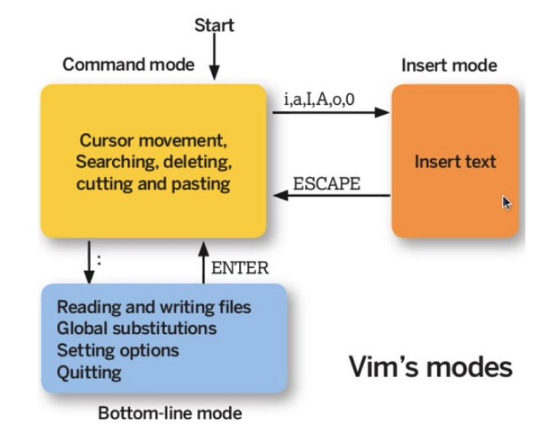 </div><br>


在指令列模式下，有以下命令用于离开或者保存文件。


| 命令 | 作用 |
| --- | --- |
| :w | 写入磁盘|
| :w! | 当文件为只读时，强制写入磁盘。到底能不能写入，与用户对该文件的权限有关 |
| :q | 离开 |
| :q! | 强制离开不保存 |
| :wq | 写入磁盘后离开 |
| :wq!| 强制写入磁盘后离开 |


在**一般指令模式(Command mode)**下，常用的命令汇总(掌握一些有利于提高在vim下的开发和编码能力，很多时候在公司是直接在vim环境下修改代码，特别是c++/shell语言的开发。)：

<div align="center"> 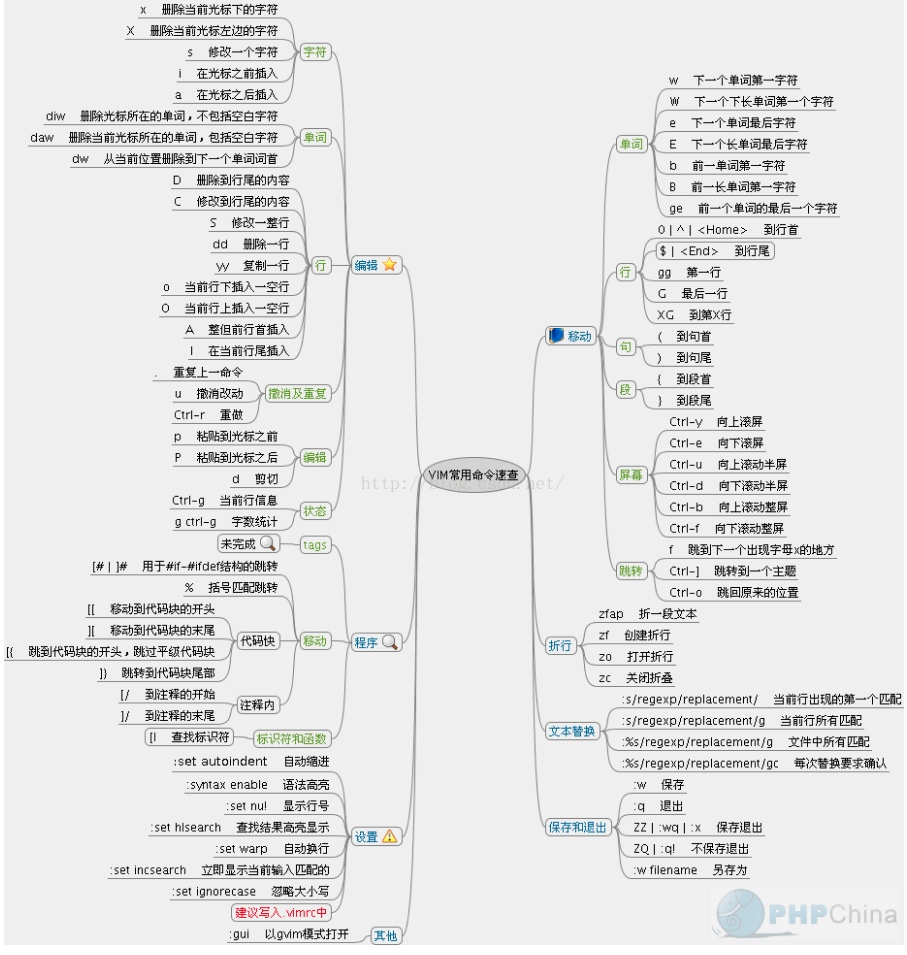 </div>

更多参考: 

 - [vim常用命令总结 ](https://www.cnblogs.com/yangjig/p/6014198.html)

### GNU

GNU 计划，译为革奴计划，它的目标是创建一套完全自由的操作系统，称为 GNU，其内容软件完全以 GPL 方式发布。其中 GPL 全称为 GNU 通用公共许可协议，包含了以下内容：

- 以任何目的运行此程序的自由；
- 再复制的自由；
- 改进此程序，并公开发布改进的自由。


## 二. 磁盘
### 2.1 硬盘（HDD）

[Decoding UCS Invicta – Part 1](https://blogs.cisco.com/datacenter/decoding-ucs-invicta-part-1)

Hard Disk Drives(HDD) 俗称硬盘，具有以下结构：

1. **盘面（Platter）**：一个硬盘有多个盘面；
2. **磁道（Track）**：盘面上的圆形带状区域，一个盘面可以有多个磁道；
3. **扇区（Track Sector）**：磁道上的一个弧段，一个磁道可以有多个扇区，它是最小的物理储存单位，目前主要有 512 bytes 与 4 K 两种大小；
4. **磁头（Head）**：与盘面非常接近，能够将盘面上的磁场转换为电信号（读），或者将电信号转换为盘面的磁场（写）；
5. **制动手臂（Actuator arm）**：用于在磁道之间移动磁头；
6. **主轴（Spindle）**：使整个盘面转动。

<div align="center"> 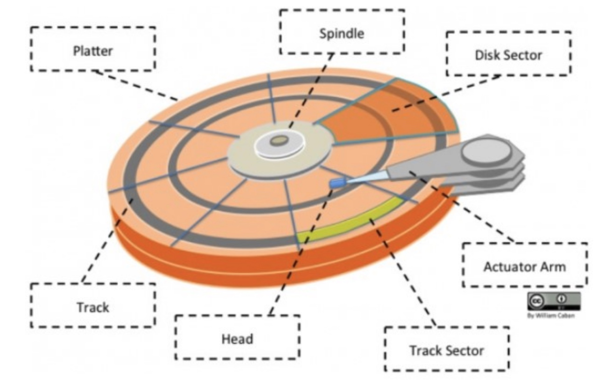 </div>


### 2.2 磁盘接口

#### 1）IDE

IDE（ATA）全称 Advanced Technology Attachment，接口速度最大为 **133MB/s**，因为并口线的抗干扰性太差，且排线占用空间较大，不利电脑内部散热，已逐渐被 SATA 所取代。

<div align="center"> 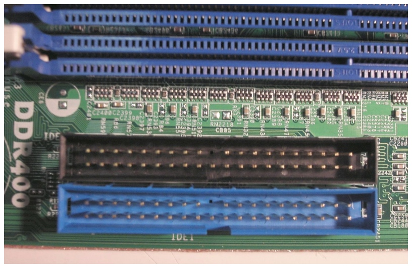</div>

#### 2）SATA

SATA 全称 Serial ATA，也就是使用串口的 ATA 接口，因抗干扰性强，且对数据线的长度要求比 ATA 低很多，**支持热插拔**等功能，SATA-II 的接口速度为 300MiB/s，而新的 SATA-III 标准可达到 **600MiB/s** 的传输速度。SATA 的数据线也比 ATA 的细得多，有利于机箱内的空气流通，整理线材也比较方便。

<div align="center"> 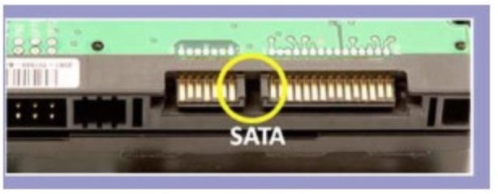 </div>

#### 3）SCSI

SCSI 全称是 Small Computer System Interface（小型机系统接口），经历多代的发展，从早期的 SCSI-II，到目前的 Ultra320 SCSI 以及 Fiber-Channel（光纤通道），接口型式也多种多样。SCSI 硬盘广为**工作站级个人电脑以及服务器所使用**，因此会使用较为先进的技术，如碟片转速 15000rpm 的高转速，且资料传输时 CPU 占用率较低，但是单价也比相同容量的 ATA 及 SATA 硬盘更加昂贵。

#### 4）SAS

SAS（Serial Attached SCSI）是新一代的 SCSI 技术，和 SATA 硬盘相同，都是采取序列式技术以获得更高的传输速度，可达到 **6Gb/s**。此外也透过缩小连接线改善系统内部空间等。

### 2.2 磁盘的文件名

Linux 中每个硬件都被当做一个文件，包括磁盘。磁盘以磁盘接口类型进行命名，常见磁盘的文件名如下：

- IDE 磁盘：/dev/hd[a-d]
- SATA/SCSI/SAS 磁盘：/dev/sd[a-p]

其中文件名后面的序号的确定与系统侦测到磁盘的顺序有关，而与磁盘所插入的插槽位置无关。

## 三. 分区

### 3.1 分区表

磁盘分区表主要有两种格式: 一种是限制较多的**MBR 分区表**，一种是较新且限制较少的 **GPT分区表**。

#### 1) MBR

MBR 中，第一个扇区最重要，里面有主要开机记录（Master boot record, MBR）及分区表（partition table），其中 MBR 占**446 bytes**，**分区表占 64 bytes**。

分区表只有 64 bytes，最多只能存储**4 个分区**，这 4个分区为: **主分区（Primary）**和**扩展分区（Extended）**。**其中扩展分区只有一个**，它将其它扇区用来记录分区表，因此通过扩展分区可以分出更多分区，这些分区称为**逻辑分区**。

Linux 也把分区当成文件，分区文件的命名方式为：磁盘文件名 + 编号，例如 /dev/sda1。注意，**逻辑分区的编号从5开始**。

#### 2) GPT

不同的磁盘有不同的扇区大小，例如 512bytes 和最新磁盘的4k。**GPT 为了兼容所有磁盘，在定义扇区上使用逻辑区块地址**（Logical Block Address, LBA），**LBA 默认大小为 512 bytes**。

GPT 第 1 个区块记录了 MBR，紧接着是 33 个区块记录分区信息，并把最后的 33 个区块用于对分区信息进行备份。这 33 个区块第一个为 GPT 表头纪录，这个部份纪录了分区表本身的位置与大小和备份分区的位置，同时放置了分区表的**校验码 (CRC32)**，操作系统可以根据这个校验码来判断 GPT 是否正确。若有错误，可以使用备份分区进行恢复。

**GPT 没有扩展分区概念，都是主分区**，每个 LAB 可以分4个分区，因此总共可以分 4 * 32 = **128个分区**。

MBR 不支持 2.2 TB 以上的硬盘，GPT 则最多支持到 2<sup>33</sup> TB = 8 ZB。


### 3.2 开机检测程序

#### 1. BIOS

BIOS（Basic Input/Output System，基本输入输出系统），它是一个固件（嵌入与硬件中的软件），BIOS 程序存放在断电后内容不会丢失的只读内存中。

**BIOS 是开机的时候计算机执行的第一个程序**，这个程序知道可以开机的磁盘，**并读取磁盘第一个扇区的 MBR**，由 MBR 执行 MBR 中的开机管理程序，这个开机管理程序会加载操作系统的核心文件。

MBR 中的开机管理程序提供以下功能：**选单、载入核心文件以及转交其它开机管理程序**。

**转交**这个功能可以用来实现了多重引导，只需要将另一个操作系统的开机管理程序安装在其它分区的启动扇区上，在启动 MBR 中的开机管理程序时，就可以通过选单选择启动当前的操作系统或者转交给其它开机管理程序从而启动另一个操作系统。

下图中，第一扇区的 MBR 中的开机管理程序提供了两个选单：M1、M2，M1 指向了 Windows 操作系统，而 M2 指向其它分区的启动扇区，里面包含了另外一个开机管理程序，提供了一个指向 Linux 的选单。

<div align="center"> 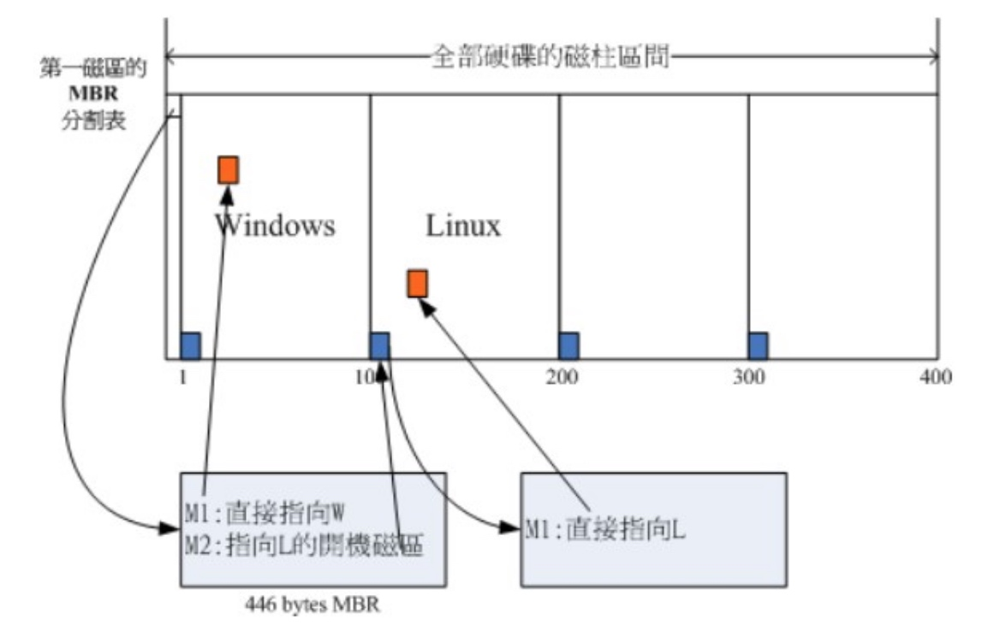 </div><br>


安装多重引导，最好先安装 Windows 再安装 Linux。因为安装 Windows 时会覆盖掉 MBR，而 Linux 可以选择将开机管理程序安装在 MBR 或者其它分区的启动扇区，并且可以设置开机管理程序的选单。

#### 2. UEFI

BIOS 不可以读取 GPT 分区表，而 UEFI 可以。

## 四. 文件系统

### 4.1 分区与文件系统

**对分区进行格式化是为了在分区上建立文件系统**。一个分区通常只能格式化为一个文件系统，但是磁盘阵列等技术可以将一个分区格式化为多个文件系统。

### 4.2 组成

<div align="center"> 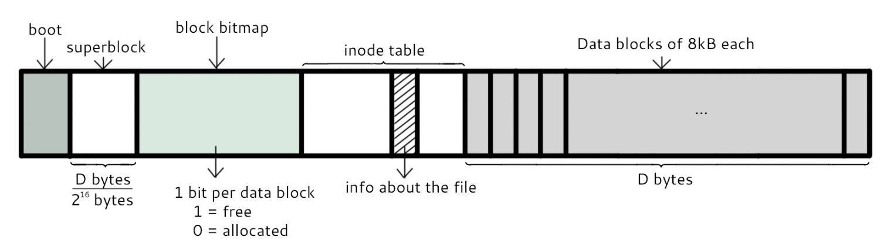 </div><br>


最主要的几个组成部分如下：

1. **inode**：一个文件占用一个 inode，记录文件的**属性**，同时记录此文件的内容所在的**block 编号**；
2. **block**：记录文件的**内容**，文件太大时，会占用多个 block。

除此之外还包括：

1. **superblock**：记录文件系统的整体信息，包括 inode 和 block 的总量、使用量、剩余量，以及文件系统的格式与相关信息等；
2. **block bitmap**：记录 block 是否被使用的位域；

### 4.3 文件读取

对于 Ext2 文件系统，当要读取一个文件的内容时，先在 inode 中去查找文件内容所在的所有 block，然后把所有 block 的内容读出来。

<div align="center"> 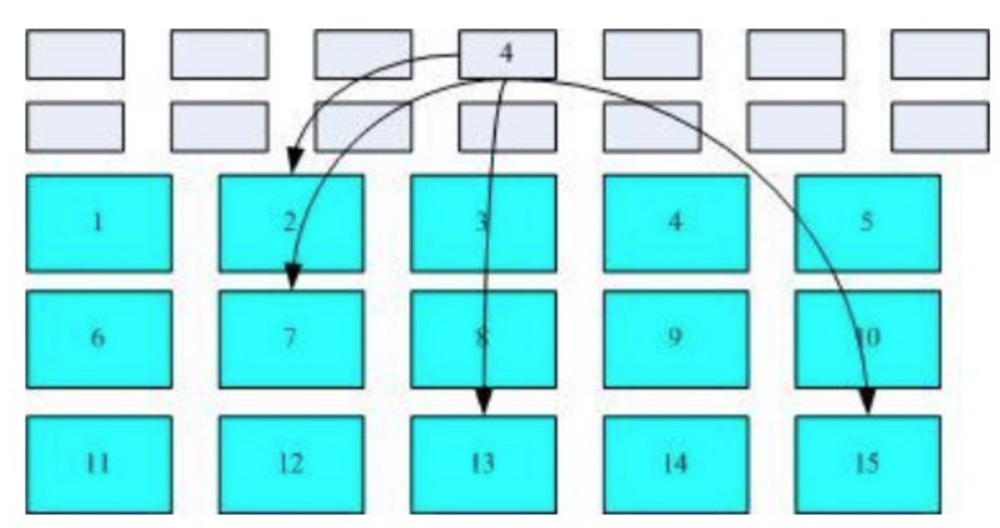 </div><br>

而对于 FAT 文件系统，它没有 inode，每个 block 中存储着下一个 block 的编号。

<div align="center"> 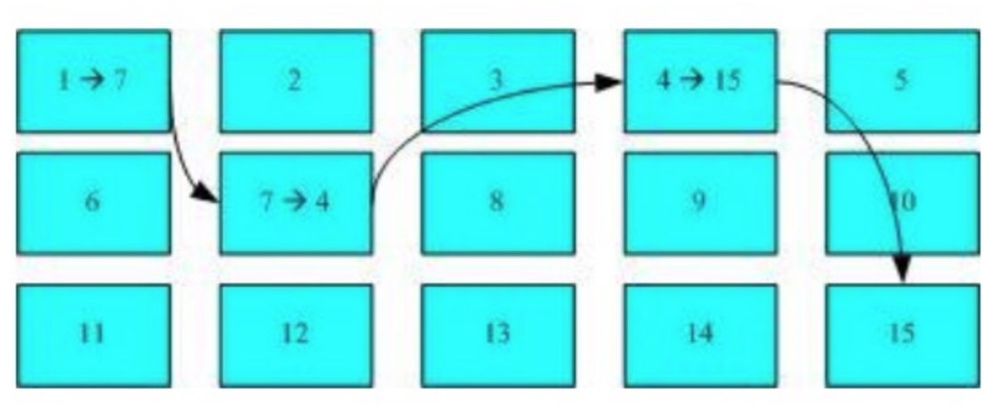 </div><br>

### 4.4 磁盘碎片

指一个文件内容所在的 block 过于分散。

#### 4.4.1 block

在 Ext2 文件系统中所支持的 block 大小有 1K，2K 及 4K 三种，不同的大小限制了单个文件和文件系统的最大大小。

| 大小 | 1KB | 2KB | 4KB |
| :---: | :---: | :---: | :---: |
| 最大单一文件 | 16GB | 256GB | 2TB |
| 最大文件系统 | 2TB | 8TB | 16TB |

一个 block 只能被一个文件所使用，未使用的部分直接浪费了。因此如果需要存储大量的小文件，那么最好选用比较小的 block。

#### 4.4.2 inode

inode 具体包含以下信息：

- 权限 (read/write/excute)；
- 拥有者与群组 (owner/group)；
- 容量；
- 建立或状态改变的时间 (ctime)；
- 最近一次的读取时间 (atime)；
- 最近修改的时间 (mtime)；
- 定义文件特性的旗标 (flag)，如 SetUID...；
- 该文件真正内容的指向 (pointer)。

inode 具有以下特点：

- 每个 inode 大小均固定为 128 bytes (新的 ext4 与 xfs 可设定到 256 bytes)；
- 每个文件都仅会占用一个 inode。

inode 中记录了文件内容所在的 block 编号，但是每个 block 非常小，一个大文件随便都需要几十万的 block。而一个 inode 大小有限，无法直接引用这么多 block 编号。因此引入了间接、双间接、三间接引用。间接引用是指，让 inode 记录的引用 block 块当成 inode 用来记录引用信息。

<div align="center"> 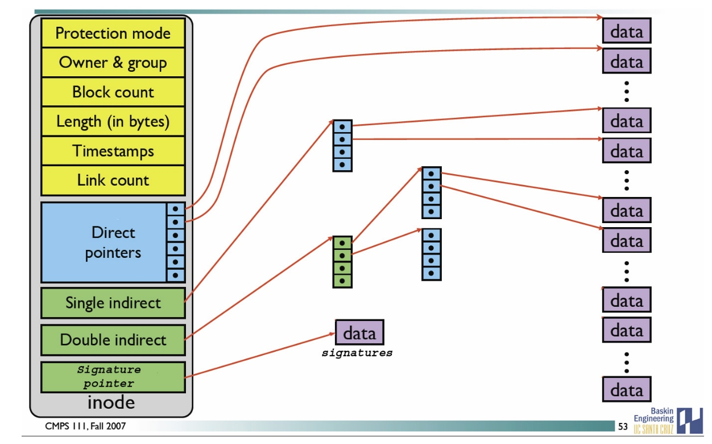 </div><br>


### 4.5 目录

建立一个目录时，会分配一个 inode 与至少一个 block。block 记录的内容是目录下所有文件的 inode 编号以及文件名。可以看出文件的 inode 本身不记录文件名，文件名记录在目录中，因此新增文件、删除文件、更改文件名这些操作与目录的 w 权限有关。

### 4.6 日志

如果突然断电，那么文件系统会发生错误，例如断电前只修改了 block bitmap，而还没有将数据真正写入 block 中。

ext3/ext4 文件系统引入了日志功能，可以利用日志来修复文件系统。

### 5.7 挂载

挂载利用目录作为文件系统的进入点，也就是说，进入目录之后就可以读取文件系统的数据。

### 5.8 目录配置

为了使不同 Linux 发行版本的目录结构保持一致性，Filesystem Hierarchy Standard (FHS) 规定了 Linux 的目录结构。最基础的三个目录如下：

- / (root, 根目录)
- /usr (unix software resource)：所有系统默认软件都会安装到这个目录；
- /var (variable)：存放系统或程序运行过程中的数据文件。

<div align="center"> 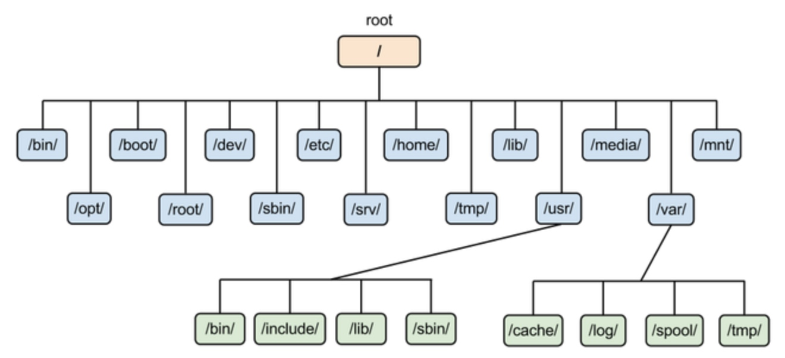 </div><br>


## 五. 文件

### 5.1 文件属性

用户分为三种：文件拥有者、群组以及其它人，对不同的用户有不同的文件权限。

使用 ls 查看一个文件时，会显示一个文件的信息，例如 `drwxr-xr-x. 3 root root 17 May 6 00:14 .config`，对这个信息的解释如下：

- drwxr-xr-x：文件类型以及权限，第 1 位为文件类型字段，后 9 位为文件权限字段。
- 3：链接数；
- root：文件拥有者；
- root：所属群组；
- 17：文件大小；
- May 6 00:14：文件最后被修改的时间；
- .config：文件名。

常见的文件类型及其含义有：

- d：目录；
- -：文件；
- l：链接文件；

9 位的文件权限字段中，每 3 个为一组，共 3 组，每一组分别代表对文件拥有者、所属群组以及其它人的文件权限。一组权限中的 3 位分别为 r、w、x 权限，表示可读、可写、可执行。

### 5.2 文件时间

1. modification time (mtime)：文件的内容更新就会更新；
2. status time (ctime)：文件的状态（权限、属性）更新就会更新；
3. access time (atime)：读取文件时就会更新。

### 5.3 文件与目录的基本操作

- **ls**: 列出文件或者目录的信息，目录的信息就是其中包含的文件
- **cd**: 更换当前目录. `cd [相对路径或绝对路径]`
- **mkdir**: 创建目录
   - `-m ：配置目录权限; -p ：递归创建目录`
- **rmdir**: 删除目录，必须为空。 `-p ：递归删除目录`
- **touch**: 更新文件时间或者建立新文件.

    ```
    # touch [-acdmt] filename
    -a ： 更新 atime
    -c ： 更新 ctime，若该文件不存在则不建立新文件
    -m ： 更新 mtime
    -d ： 后面可以接更新日期而不使用当前日期，也可以使用 --date="日期或时间"
    -t ： 后面可以接更新时间而不使用当前时间，格式为[YYYYMMDDhhmm]
    ``` 

- **cp**: 复制文件; `-r ：递归持续复制; -i ：若目标文件已经存在时，在覆盖前会先询问`
- **rm**: 删除文件
    - -r ：递归删除  
- **mv**: 移动文件
    - -f ： force 强制的意思，如果目标文件已经存在，不会询问而直接覆盖
- **chmod**: 修改权限

    ```html
     # chmod [ugoa]  [+-=] [rwx] dirname/filename
    - u：拥有者
    - g：所属群组
    - o：其他人
    - a：所有人
    - +：添加权限
    - -：移除权限
    - =：设定权限
    ```    
    
### 5.4 文件默认权限

- 文件默认权限：文件默认没有可执行权限，因此为**666**，也就是 -rw-rw-rw- 。
- 目录默认权限：目录必须要能够进入，也就是必须拥有可执行权限，因此为 777 ，也就是 drwxrwxrwx。

可以通过**umask** 设置或者查看文件的默认权限，通常以掩码的形式来表示，例如 002 表示其它用户的权限去除了一个 2 的权限，也就是写权限，因此建立新文件时默认的权限为 -rw-rw-r--。

### 5.5 目录的权限

文件名不是存储在一个文件的内容中，而是存储在一个文件所在的目录中。因此，拥有文件的 w 权限并不能对文件名进行修改。

目录存储文件列表，一个目录的权限也就是对其文件列表的权限。因此:

 - 目录的 r 权限表示可以读取文件列表；
 - w 权限表示可以修改文件列表，具体来说，就是添加删除文件，对文件名进行修改；
 - x 权限可以让该目录成为**工作目录**，**x权限是 r 和 w 权限的基础**，如果不能使一个目录成为工作目录，也就没办法读取文件列表以及对文件列表进行修改了。

### 5.6 链接

```html
# ln [-sf] source_filename dist_filename
-s ：默认是 hard link，加 -s 为 symbolic link
-f ：如果目标文件存在时，先删除目标文件
```

#### 1. 实体链接(硬连接)

它和普通文件类似，实体链接文件的 inode 都指向源文件所在的 block 上，也就是说读取文件直接从源文件的 block 上读取。可以理解是一种copy.

删除任意一个条目，文件还是存在，只要引用数量不为 0。

有以下限制：不能跨越 File System、不能对目录进行链接。

```html
# ln /etc/crontab .
# ll -i /etc/crontab crontab
34474855 -rw-r--r--. 2 root root 451 Jun 10 2014 crontab
34474855 -rw-r--r--. 2 root root 451 Jun 10 2014 /etc/crontab
```

#### 2. 符号链接(软连接)

符号链接文件保存着源文件所在的绝对路径，在读取时会定位到源文件上，可以理解为 Windows 的快捷方式。

当源文件被删除了，链接文件就打不开了。

可以为目录建立链接。

```html
# ll -s /etc/crontab /root/crontab2
34474855 -rw-r--r--. 2 root root 451 Jun 10 2014 /etc/crontab
53745909 lrwxrwxrwx. 1 root root 12 Jun 23 22:31 /root/crontab2 -> /etc/crontab
```

### 5.7 获取文件内容

- **cat**: 取得文件内容
- **tac**: 是cat 的反向操作，从最后一行开始打印。
- **more**: 和 cat 不同的是它可以一页一页查看文件内容，比较适合大文件的查看。
- **less**: 和 more 类似，但是多了一个向前翻页的功能。
- **head**: 取得文件前几行
    - -n ：后面接数字，代表显示几行的意思
- **tail**: 是 head 的反向操作，只是取得是后几行。
- **od**: 以字符或者十六进制的形式显示二进制文件。

### 5.8 指令与文件搜索
- **which**: 指令搜索, 查询指令所在的目录。 
   -  `which -a java`
- **whereis**: 文件搜索。速度比较快，因为它只搜索几个特定的目录。
- **locate**: 文件搜索。可以用关键字或者**正则表达式**进行搜索。locate 使用 **/var/lib/mlocate/** 这个数据库来进行搜索，它存储在内存中，并且每天更新一次，所以无法用 locate 搜索新建的文件。可以使用 updatedb 来立即更新数据库。
    - `locate [-ir] keyword`  
- **find**: 文件搜索。可以使用文件的属性和权限进行搜索。
    - `find [basedir] [option]`
    - 例子：`find . -name "shadow*"`
    - 与时间有关的选项
        -  -mtime  n ：列出在 n 天前的**那一天**修改过内容的文件
        - -mtime +n ：列出在 n 天**之前** (不含 n 天本身) 修改过内容的文件
        - -mtime -n ：列出在 n 天**之内** (含 n 天本身) 修改过内容的文件
        - -newer file ： 列出比 file 更新的文件  
    - 与文件拥有者和所属群组有关的选项
        - -uid n
        - -gid n
        - -user name
        - -group name
        - -nouser ：搜索拥有者不存在 /etc/passwd 的文件
        - -nogroup：搜索所属群组不存在于 /etc/group 的文件
    - 与文件权限和名称有关的选项
        - -name filename
        - -size [+-]SIZE：搜寻比 SIZE 还要大 (+) 或小 (-) 的文件。这个 SIZE 的规格有：c: 代表 byte，k: 代表 1024bytes。所以，要找比 50KB 还要大的文件，就是 -size +50k
        - -type TYPE
        - -perm mode  ：搜索权限等于 mode 的文件
        - -perm -mode ：搜索权限包含 mode 的文件
        - -perm /mode ：搜索权限包含任一 mode 的文件 

### 5.9 文件内容操作
#### grep

使用正则表示式把匹配的行提取出来。

```html
$ grep [-acinv] [--color=auto] 搜寻字符串 filename
-a ： 将 binary 文件以 text 文件的方式进行搜寻
-c ： 计算找到个数
-i ： 忽略大小写
-n ： 输出行号
-v ： 反向选择，亦即显示出没有 搜寻字符串 内容的那一行
--color=auto ：找到的关键字加颜色显示
```

范例：把含有 the 字符串的行提取出来（注意默认会有 --color=auto 选项，因此以下内容在 Linux 中有颜色显示 the 字符串）

```html
$ grep -n 'the' regular_express.txt
8:I can't finish the test.
12:the symbol '*' is represented as start.
15:You are the best is mean you are the no. 1.
16:The world Happy is the same with "glad".
18:google is the best tools for search keyword
```

因为 { 和 } 在 shell 是有特殊意义的，因此必须要使用转义字符进行转义。

```html
$ grep -n 'go\{2,5\}g' regular_express.txt
```

#### printf

用于格式化输出。

它不属于管道命令，在给 printf 传数据时需要使用 $( ) 形式。

```html
$ printf '%10s %5i %5i %5i %8.2f \n' $(cat printf.txt)
    DmTsai    80    60    92    77.33
     VBird    75    55    80    70.00
       Ken    60    90    70    73.33
```

#### awk

可以根据字段的某些条件进行匹配，例如匹配字段小于某个值的那一行数据。

```html
$ awk '条件类型 1 {动作 1} 条件类型 2 {动作 2} ...' filename
```

awk 每次处理一行，处理的最小单位是字段，每个字段的命名方式为：\$n，n 为字段号，从 1 开始，\$0 表示一整行。

范例 1：取出登录用户的用户名和 ip

```html
$ last -n 5
dmtsai pts/0 192.168.1.100 Tue Jul 14 17:32 still logged in
dmtsai pts/0 192.168.1.100 Thu Jul 9 23:36 - 02:58 (03:22)
dmtsai pts/0 192.168.1.100 Thu Jul 9 17:23 - 23:36 (06:12)
dmtsai pts/0 192.168.1.100 Thu Jul 9 08:02 - 08:17 (00:14)
dmtsai tty1 Fri May 29 11:55 - 12:11 (00:15)

$ last -n 5 | awk '{print $1 "\t" $3}
```

awk 变量：

| 变量名称 | 代表意义 |
| -- | -- |
| NF | 每一行拥有的字段总数 |
| NR | 目前所处理的是第几行数据 |
| FS | 目前的分隔字符，默认是空格键 |

范例 2：输出正在处理的行号，并显示每一行有多少字段

```html
$ last -n 5 | awk '{print $1 "\t lines: " NR "\t columns: " NF}'
dmtsai lines: 1 columns: 10
dmtsai lines: 2 columns: 10
dmtsai lines: 3 columns: 10
dmtsai lines: 4 columns: 10
dmtsai lines: 5 columns: 9
```

可以使用条件，其中等于使用 ==。

范例 3：/etc/passwd 文件第三个字段为 UID，对 UID 小于 10 的数据进行处理。

```text
$ cat /etc/passwd | awk 'BEGIN {FS=":"} $3 < 10 {print $1 "\t " $3}'
root 0
bin 1
daemon 2
```        

## 六. 压缩与打包

### 6.1 压缩文件名

Linux 底下有很多压缩文件名，常见的如下：

| 扩展名 | 压缩程序 |
| -- | -- |
| \*.Z | compress |
|\*.zip |  zip |
|\*.gz  | gzip|
|\*.bz2 |  bzip2 |
|\*.xz  | xz |
|\*.tar |  tar 程序打包的数据，没有经过压缩 |
|\*.tar.gz | tar 程序打包的文件，经过 gzip 的压缩 |
|\*.tar.bz2 | tar 程序打包的文件，经过 bzip2 的压缩 |
|\*.tar.xz | tar 程序打包的文件，经过 xz 的压缩 |

### 6.2 压缩指令

-  **gzip**: Linux 使用最广的压缩指令，可以解开 compress、zip 与 gzip 所压缩的文件。**经过 gzip 压缩过，源文件就不存在了**。
    - 可以使用 zcat、zmore、zless 来读取压缩文件的内容。  

    ```html
    $ gzip [-cdtv#] filename
    -c ：将压缩的数据输出到屏幕上
    -d ：解压缩
    -t ：检验压缩文件是否出错
    -v ：显示压缩比等信息
    -# ： # 为数字的意思，代表压缩等级，数字越大压缩比越高，默认为 6
    ```
- **bzip2**: 提供比 gzip 更高的压缩比。
    - 查看命令：bzcat、bzmore、bzless、bzgrep。

    ```html
    $ bzip2 [-cdkzv#] filename
    -k ：保留源文件
    ```
- **xz**: 提供比 bzip2 更佳的压缩比。压缩比越高，压缩的时间也越长
    - 查看命令：xzcat、xzmore、xzless、xzgrep。

    ```html
    $ xz [-dtlkc#] filename
    ```
    
### 6.3 打包

**压缩指令只能对一个文件进行压缩，而打包能够将多个文件打包成一个大文件**。tar 不仅可以用于打包，也可以使用 gip、bzip2、xz 将打包文件进行压缩。

```html
$ tar [-z|-j|-J] [cv] [-f 新建的 tar 文件] filename...  ==打包压缩
$ tar [-z|-j|-J] [tv] [-f 已有的 tar 文件]              ==查看
$ tar [-z|-j|-J] [xv] [-f 已有的 tar 文件] [-C 目录]    ==解压缩
-z ：使用 zip；
-j ：使用 bzip2；
-J ：使用 xz；
-c ：新建打包文件；
-t ：查看打包文件里面有哪些文件；
-x ：解打包或解压缩的功能；
-v ：在压缩/解压缩的过程中，显示正在处理的文件名；
-f : filename：要处理的文件；
-C 目录 ： 在特定目录解压缩。
```

| 使用方式 | 命令 |
| :---: | --- |
| 打包压缩 | tar -jcv -f filename.tar.bz2 要被压缩的文件或目录名称 |
| 查 看 | tar -jtv -f filename.tar.bz2 |
| 解压缩 | tar -jxv -f filename.tar.bz2 -C 要解压缩的目录 |

## 七. Bash

可以通过 Shell 请求内核提供服务，Bash 正是 Shell 的一种。

### 7.1 特性

- **命令历史**：记录使用过的命令。本次登录所执行的命令都会暂时存放到内存中，\~/.bash_history 文件中记录的是前一次登录所执行过的命令。history命令
- **命令与文件补全**：快捷键：tab。
- **命名别名**：例如 lm 是 ls -al 的别名。
- **shell scripts**。
- **通配符**：例如 ls -l /usr/bin/X\* 列出 /usr/bin 下面所有以 X 开头的文件。

### 7.2 变量操作

- **export**: 命令将自定义变量转成环境变量，环境变量可以在子程序中使用，所谓子程序就是由当前 Bash 而产生的子 Bash。
- Bash 的变量可以声明为数组和整数数字。注意数字类型没有浮点数。如果不进行声明，默认是字符串类型。变量的**声明使用 declare** 命令：

    ```html
    $ declare [-aixr] variable
    -a ： 定义为数组类型
    -i ： 定义为整数类型
    -x ： 定义为环境变量
    -r ： 定义为 readonly 类型
    ```
    
    使用 [ ] 来对数组进行索引操作：
    
    ```bash
    $ array[1]=a
    $ array[2]=b
    $ echo ${array[1]}
    ```

### 7.3 指令搜索顺序

1. 以绝对或相对路径来执行指令，例如 /bin/ls 或者 ./ls ；
2. 由别名找到该指令来执行；
3. 由 Bash 内建的指令来执行；
4. 按 \$PATH 变量指定的搜索路径的顺序找到第一个指令来执行。

### 7.4 数据流重定向

重定向指的是使用文件代替标准输入、标准输出和标准错误输出。

| 1 | 代码 | 运算符 |
| :---: | :---: | :---:|
| 标准输入 (stdin)  | 0 | < 或 << |
| 标准输出 (stdout) | 1 | > 或 >> |
| 标准错误输出 (stderr) | 2 | 2> 或 2>> |

其中，有一个箭头的表示以覆盖的方式重定向，而有两个箭头的表示以追加的方式重定向。

可以将不需要的标准输出以及标准错误输出重定向到 /dev/null，相当于扔进垃圾箱。

如果需要将标准输出以及标准错误输出同时重定向到一个文件，需要将某个输出转换为另一个输出，例如 2>&1 表示将标准错误输出转换为标准输出。

```bash
$ find /home -name .bashrc > list 2>&1
```

## 八. 管线指令

管线是将一个命令的标准输出作为另一个命令的标准输入，在数据需要经过多个步骤的处理之后才能得到我们想要的内容时就可以使用管线。在命令之间使用 | 分隔各个管线命令。

```bash
$ ls -al /etc | less
```

### 8.1 提取指令cut

cut 对数据进行切分，取出想要的部分。切分过程一行一行地进行。包含以下功能：

 - 文件内容查看
 - 显示行中的指定部分，删除文件中指定字段
 - 显示文件的内容，类似于下的type命令。
 - **连接两个或多个文件**，如cut fl f2 > f3将把文件fl和几的内容合并起来，然后通过输出重定向符“>”的作用，将它们放入文件f3中。


选项有：

- -b：仅显示行中指定直接范围的内容；
- -c：仅显示行中指定范围的**字符**；
- -d：指定字段的**分隔符**，默认的字段分隔符为“TAB”；
- -f：显示**指定字段**的内容，即哪些列；
- -n：与“-b”选项连用，不分割多字节字符；
- --complement：补足被选择的字节、字符或字段； 
- --out-delimiter=<字段分隔符>：指定输出内容是的字段分割符；
- --help：显示指令的帮助信息；
- --version：显示指令的版本信息。
 
更多参考：

 - [Linux：cut命令详解](https://www.cnblogs.com/Spiro-K/p/6361646.html)

### 8.2 排序指令sort/uniq
#### sort
**sort**：对内容进行排序。

```html
$ sort [-fbMnrtuk] [file or stdin]
-f ：忽略大小写
-b ：忽略最前面的空格
-M ：以月份的名字来排序，例如 JAN，DEC
-n ：使用数字。比较数字的时候可以使用该参数
-r ：反向排序
-u ：相当于 unique，重复的内容只出现一次。 去重的时候使用
-t ：分隔符，默认为 tab
-k ：指定排序的区间
```

范例：/etc/passwd 文件内容以 : 来分隔，要求以第三列进行排序。

```html
$ cat /etc/passwd | sort -t ':' -k 3
root:x:0:0:root:/root:/bin/bash
dmtsai:x:1000:1000:dmtsai:/home/dmtsai:/bin/bash
alex:x:1001:1002::/home/alex:/bin/bash
arod:x:1002:1003::/home/arod:/bin/bash
```

#### uniq
**uniq**  可以将重复的数据只取一个。

```html
$ uniq [-ic]
-i ：忽略大小写
-c ：进行计数
```

范例：取得每个人的登录总次数

```html
$ last | cut -d ' ' -f 1 | sort | uniq -c
1
6 (unknown
47 dmtsai
4 reboot
7 root
1 wtmp
```

### 8.3 双向输出重定向

输出重定向会将输出内容重定向到文件中，而  **tee**  不仅能够完成这个功能，还能保留屏幕上的输出。也就是说，使用 tee 指令，一个输出会同时传送到文件和屏幕上。

```html
$ tee [-a] file
```

#### 字符转换指令
##### tr
**tr**: 用来删除一行中的字符，或者对字符进行替换。

```html
$ tr [-ds] SET1 ...
-d ： 删除行中 SET1 这个字符串
```

范例，将 last 输出的信息所有小写转换为大写。

```html
$ last | tr '[a-z]' '[A-Z]'
```

##### col
**col**  将tab字符转为空格字符。

```html
$ col [-xb]
-x ： 将 tab 键转换成对等的空格键
```

##### expand
**expand**  将 tab 转换一定数量的空格，默认是 8 个。

```html
$ expand [-t] file
-t ：tab 转为空格的数量
```

##### join
**join**  将有相同数据的那一行合并在一起。

```html
$ join [-ti12] file1 file2
-t ：分隔符，默认为空格
-i ：忽略大小写的差异
-1 ：第一个文件所用的比较字段
-2 ：第二个文件所用的比较字段
```

##### paste
**paste**  直接将两行粘贴在一起。

```html
$ paste [-d] file1 file2
-d ：分隔符，默认为 tab
```

### 8.4 分区指令

**split**  将一个文件划分成多个文件。

```html
$ split [-bl] file PREFIX
-b ：以大小来进行分区，可加单位，例如 b, k, m 等
-l ：以行数来进行分区。
- PREFIX ：分区文件的前导名称
```


## 九. 进程管理

### 9.1 查看进程
#### 1. ps
要对进程进行监测和控制，首先必须要了解当前进程的情况，也就是需要查看当前进程，而 ps 命令就是最基本同时也是非常强大的进程查看命令。使用该命令可以确定有哪些进程正在运行和运行的状态、进程是否结束、进程有没有僵死、哪些进程占用了过多 的资源等等。总之大部分信息都是可以通过执行该命令得到的。

参数：ps的参数非常多, 在此仅列出几个常用的参数并大略介绍含义:

 - -A: 列出所有的进程，等价于-e。
 - -w: 显示加宽可以显示较多的资讯
 - -au: 显示较详细的资讯
 - -aux: 显示所有包含其他使用者的行程
 - -ef: 显示环境

更多参考： 

- [参数列表](http://man.linuxde.net/ps)
- [ps命令详解](https://www.cnblogs.com/sexybear/p/Linux_ps.html)

#### 2. top
参考: [Top 命令详解](./top命令详解.md)
- 第一行：**任务队列信息**
    - 10:01:23 当前系统时间
    - **days**：系统运行时间，格式为时:分（在这期间没有重启过）
    - **users**：当前登录用户数
    - **load average**: 1.15, 1.42, 1.44 load average后面的三个数分别是**1分钟、5分钟、15分钟**的负载情况。
    
- 第二行：**进程信息**
    - Tasks 任务（进程），
    - **totoal**： 系统现在共有进程数，
    - **running**：其中处于运行中进程个数。
    - **sleeping**：休眠中的线程数。
    - **stoped**：停止的进程数
    - **zombie**：僵尸进程数
 
- 第三行：**cpu状态**
    - 6.7% **us**：用户空间占用CPU的百分比。
    - 0.4% **sy**：内核空间占用CPU的百分比。
    - 0.0% **ni**：改变过优先级的进程占用CPU的百分比
    - 92.9% **id**：空闲CPU百分比
    - 0.0% **wa**：IO等待占用CPU的百分比
    - 0.0% **hi**： 硬中断（Hardware IRQ）占用CPU的百分比
    - 0.0% **si** 软中断（Software Interrupts）占用CPU的百分比

- 第四行：**内存状态**
    - **total**: 物理内存总量
    - **used**: 使用中的内存总量
    - **free**: 空闲内存总量
    - **buffers**: 缓存的内存量
 
- 第五行：**swap交换分区**
    - **total**: 交换区总量
    - **used**: 使用的交换区总量
    - **free**: 空闲交换区总量
    - **cached**: 缓冲的交换区总量

- 第六行：进程信息

#### 3. pstree

显示进程状态树，pstree命令可以列出当前的进程，以及它们的树状结构。　主要选项如下。

- -a：显示执行程序的命令与完整参数。
- -c：取消同名程序，合并显示。
- -n：以PID大小排序。
- -p：显示PID。
- -u：显示UID信息。

示例：查看所有进程树

```
# pstree -A
```

更多参考:

- [Linux命令之pstree - 以树状图显示进程间的关系](https://www.cnblogs.com/0616--ataozhijia/p/4015465.html)

#### 4. netstat

查看占用端口的进程

```
# netstat -anp | grep port
```


### 9.2 孤儿进程

一个父进程退出，而它的一个或多个子进程还在运行，那么这些子进程将成为孤儿进程。孤儿进程将被 init 进程（进程号为 1）所收养，并由 init 进程对它们完成状态收集工作。

由于孤儿进程会被 init 进程收养，所以孤儿进程不会对系统造成危害。

### 9.3 僵死进程

一个子进程的进程描述符在子进程退出时不会释放，只有当父进程通过 wait() 或 waitpid() 获取了子进程信息后才会释放。如果子进程退出，而父进程并没有调用 wait() 或 waitpid()，那么子进程的进程描述符仍然保存在系统中，这种进程称之为僵死进程。

僵死进程通过 ps 命令显示出来的状态为 Z。

系统所能使用的进程号是有限的，如果大量的产生僵死进程，将因为没有可用的进程号而导致系统不能产生新的进程。

要消灭系统中大量的僵死进程，只需要将其父进程杀死，此时所有的僵死进程就会变成孤儿进程，从而被 init 所收养，这样 init 就会释放所有的僵死进程所占有的资源，从而结束僵死进程。

## 十一. I/O 复用

### 11.1 概念理解

I/O Multiplexing 又被称为 Event Driven I/O，它可以让单个进程具有处理多个 I/O 事件的能力。

当某个 I/O 事件条件满足时，进程会收到通知。

如果一个 Web 服务器没有 I/O 复用，那么每一个 Socket 连接都需要创建一个线程去处理。如果同时连接几万个连接，那么就需要创建相同数量的线程。并且相比于多进程和多线程技术，I/O 复用不需要进程线程创建和切换的开销，系统开销更小。

### 11.2 I/O 模型

- 阻塞（Blocking）
- 非阻塞（Non-blocking）
- 同步（Synchronous）
- 异步（Asynchronous）

阻塞/非阻塞是**等待 I/O 完成的方式**，阻塞要求用户程序停止执行，直到I/O完成，而非阻塞在I/O完成之前还可以继续执行。

同步/异步是**获知 I/O 完成的方式**，同步需要时刻关心I/O是否已经完成，异步无需主动关心，在 I/O 完成时它会收到通知。


### 1. 同步-阻塞

这是最常见的一种模型，用户程序在使用 read() 时会执行系统调用从而陷入内核，之后就被阻塞直到系统调用完成。

应该注意到，在阻塞的过程中，其他程序还可以执行，因此阻塞不意味着整个操作系统都被阻塞。因为其他程序还可以执行，因此不消耗 CPU 时间，这种模型的执行效率会比较高。

<div align="center"> 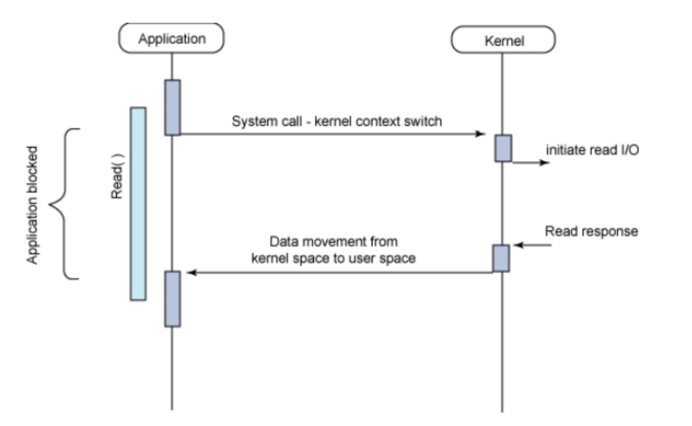 </div><br>


### 2. 同步-非阻塞

非阻塞意味着用户程序在执行系统调用后还可以继续执行，内核并不是马上执行完 I/O，而是以一个错误码来告知用户程序 I/O 还未完成。为了获得 I/O 完成事件，用户程序必须调用多次系统调用去询问内核，甚至是忙等，也就是在一个循环里面一直询问并等待。

由于 CPU 要处理更多的用户程序的询问，因此这种模型的效率是比较低的。

### 3. 异步

该模式下，I/O 操作会立即返回，之后可以处理其它操作，并且在 I/O 完成时会收到一个通知，此时会中断正在处理的操作，然后继续之前的操作。


### select/poll/epoll

这三个都是 I/O 多路复用的具体实现，select 出现的最早，之后是 poll，再是 epoll。

#### 1. select

```c
int select (int n, fd_set *readfds, fd_set *writefds, fd_set *exceptfds, struct timeval *timeout);
```

- fd_set 表示描述符集合；
- readset、writeset 和 exceptset 这三个参数指定让操作系统内核测试读、写和异常条件的描述符；
- timeout 参数告知内核等待所指定描述符中的任何一个就绪可花多少时间；
- 成功调用返回结果大于 0；出错返回结果为 -1；超时返回结果为 0。

返回结果中内核并没有声明哪些 fd_set 已经准备好了，所以如果返回值大于 0 时，程序需要遍历所有的 fd_set 判断哪个 I/O 已经准备好。

在 Linux 中 select 最多支持 1024 个 fd_set 同时轮询，其中 1024 由 Linux 内核的 FD_SETSIZE 决定。如果需要打破该限制可以修改 FD_SETSIZE，然后重新编译内核。

### 2. poll


### 3. epoll

```c
int epoll_create(int size);
int epoll_ctl(int epfd, int op, int fd, struct epoll_event *event)；
int epoll_wait(int epfd, struct epoll_event * events, int maxevents, int timeout);
```


### select 和 poll 比较

#### 1. 功能

它们提供了几乎相同的功能，但是在一些细节上有所不同：

- select 会修改 fd_set 参数，而 poll 不会；
- select 默认只能监听 1024 个描述符，如果要监听更多的话，需要修改 FD_SETSIZE 之后重新编译；
- poll 提供了更多的事件类型。

#### 2. 速度

poll 和 select 在速度上都很慢。

- 它们都采取轮询的方式来找到 I/O 完成的描述符，如果描述符很多，那么速度就会很慢；
- select 只使用每个描述符的 3 位，而 poll 通常需要使用 64 位，因此 poll 需要复制更多的内核空间。

### 3. 可移植性

几乎所有的系统都支持 select，但是只有比较新的系统支持 poll。

### eopll 工作模式

epoll_event 有两种触发模式：LT（level trigger）和 ET（edge trigger）。

#### 1. LT 模式

当 epoll_wait() 检测到描述符事件发生并将此事件通知应用程序，应用程序可以不立即处理该事件。下次调用 epoll_wait() 时，会再次响应应用程序并通知此事件。是默认的一种模式，并且同时支持 Blocking 和 No-Blocking。

#### 2. ET 模式

当 epoll_wait() 检测到描述符事件发生并将此事件通知应用程序，应用程序必须立即处理该事件。如果不处理，下次调用 epoll_wait() 时，不会再次响应应用程序并通知此事件。很大程度上减少了 epoll 事件被重复触发的次数，因此效率要比 LT 模式高。只支持 No-Blocking，以避免由于一个文件句柄的阻塞读/阻塞写操作把处理多个文件描述符的任务饿死。

### select poll epoll 应用场景

很容易产生一种错觉认为只要用 epoll 就可以了，select poll 都是历史遗留问题，并没有什么应用场景，其实并不是这样的。

#### 1. select 应用场景

select() poll() epoll_wait() 都有一个 timeout 参数，在 select() 中 timeout 的精确度为 1ns，而 poll() 和 epoll_wait() 中则为 1ms。所以 select 更加适用于实时要求更高的场景，比如核反应堆的控制。

select 历史更加悠久，它的可移植性更好，几乎被所有主流平台所支持。

#### 2. poll 应用场景

poll 没有最大描述符数量的限制，如果平台支持应该采用 poll 且对实时性要求并不是十分严格，而不是 select。

需要同时监控小于 1000 个描述符。那么也没有必要使用 epoll，因为这个应用场景下并不能体现 epoll 的优势。

需要监控的描述符状态变化多，而且都是非常短暂的。因为 epoll 中的所有描述符都存储在内核中，造成每次需要对描述符的状态改变都需要通过 epoll_ctl() 进行系统调用，频繁系统调用降低效率。epoll 的描述符存储在内核，不容易调试。

### 3. epoll 应用场景

程序只需要运行在 Linux 平台上，有非常大量的描述符需要同时轮询，而且这些连接最好是长连接。

### 4. 性能对比

> [epoll Scalability Web Page](http://lse.sourceforge.net/epoll/index.html)

# 参考资料

- 鸟哥. 鸟 哥 的 Linux 私 房 菜 基 础 篇 第 三 版[J]. 2009.
- [Linux 平台上的软件包管理](https://www.ibm.com/developerworks/cn/linux/l-cn-rpmdpkg/index.html)
- [Boost application performance using asynchronous I/O](https://www.ibm.com/developerworks/linux/library/l-async/)
- [Synchronous and Asynchronous I/O](https://msdn.microsoft.com/en-us/library/windows/desktop/aa365683(v=vs.85).aspx)
- [Linux IO 模式及 select、poll、epoll 详解](https://segmentfault.com/a/1190000003063859)
- [poll vs select vs event-based](https://daniel.haxx.se/docs/poll-vs-select.html)
- [Linux 之守护进程、僵死进程与孤儿进程](http://liubigbin.github.io/2016/03/11/Linux-%E4%B9%8B%E5%AE%88%E6%8A%A4%E8%BF%9B%E7%A8%8B%E3%80%81%E5%83%B5%E6%AD%BB%E8%BF%9B%E7%A8%8B%E4%B8%8E%E5%AD%A4%E5%84%BF%E8%BF%9B%E7%A8%8B/)
- [Linux process states](https://idea.popcount.org/2012-12-11-linux-process-states/)
- [GUID Partition Table](https://en.wikipedia.org/wiki/GUID_Partition_Table)
- [详解 wait 和 waitpid 函数](https://blog.csdn.net/kevinhg/article/details/7001719)
- [IDE、SATA、SCSI、SAS、FC、SSD 硬盘类型介绍](https://blog.csdn.net/tianlesoftware/article/details/6009110)
- [Akai IB-301S SCSI Interface for S2800,S3000](http://www.mpchunter.com/s3000/akai-ib-301s-scsi-interface-for-s2800s3000/)
- [Parallel ATA](https://en.wikipedia.org/wiki/Parallel_ATA)
- [ADATA XPG SX900 256GB SATA 3 SSD Review – Expanded Capacity and SandForce Driven Speed](http://www.thessdreview.com/our-reviews/adata-xpg-sx900-256gb-sata-3-ssd-review-expanded-capacity-and-sandforce-driven-speed/4/)
- [Decoding UCS Invicta – Part 1](https://blogs.cisco.com/datacenter/decoding-ucs-invicta-part-1)
- [硬盘](https://zh.wikipedia.org/wiki/%E7%A1%AC%E7%9B%98)
- [Difference between SAS and SATA](http://www.differencebetween.info/difference-between-sas-and-sata)
- [BIOS](https://zh.wikipedia.org/wiki/BIOS)
- [File system design case studies](https://www.cs.rutgers.edu/\~pxk/416/notes/13-fs-studies.html)
- [Programming Project #4](https://classes.soe.ucsc.edu/cmps111/Fall08/proj4.shtml)
- [FILE SYSTEM DESIGN](http://web.cs.ucla.edu/classes/fall14/cs111/scribe/11a/index.html)


